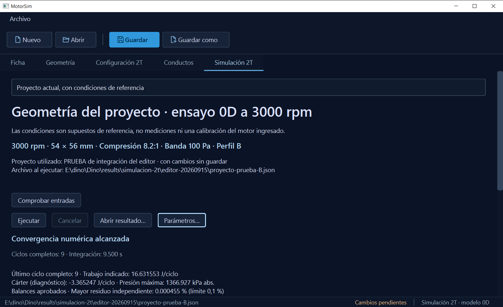
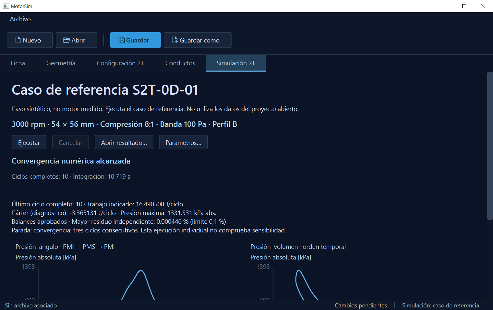
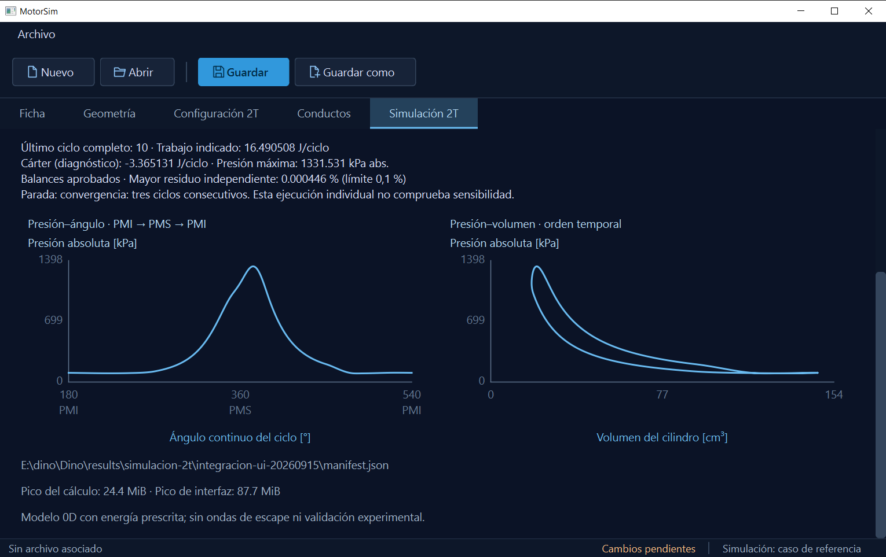
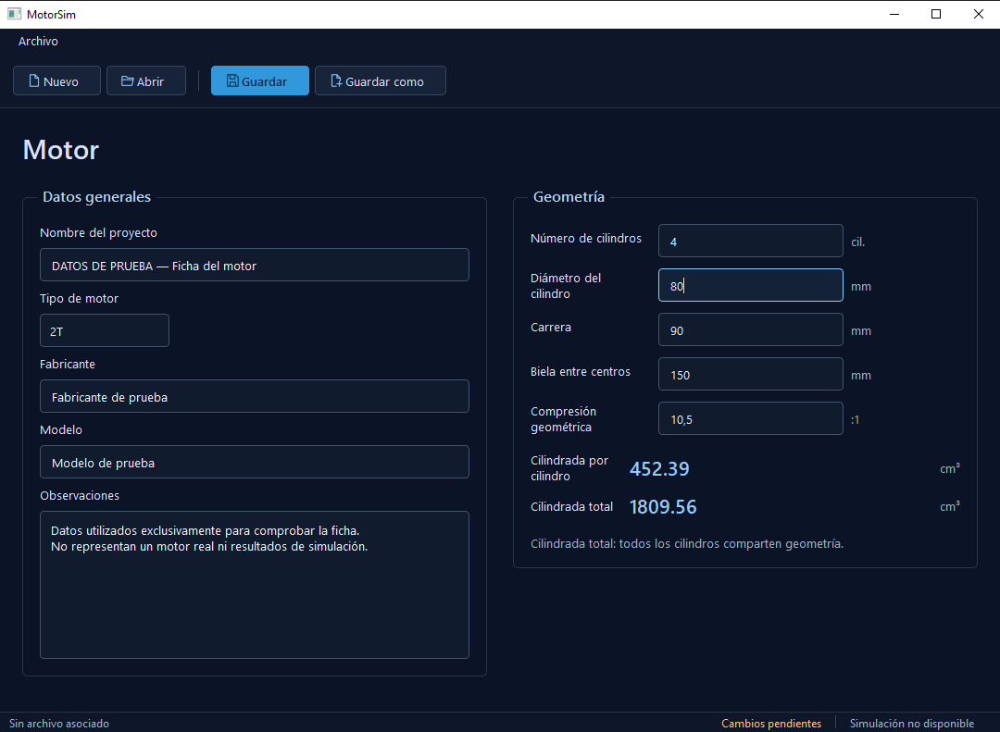
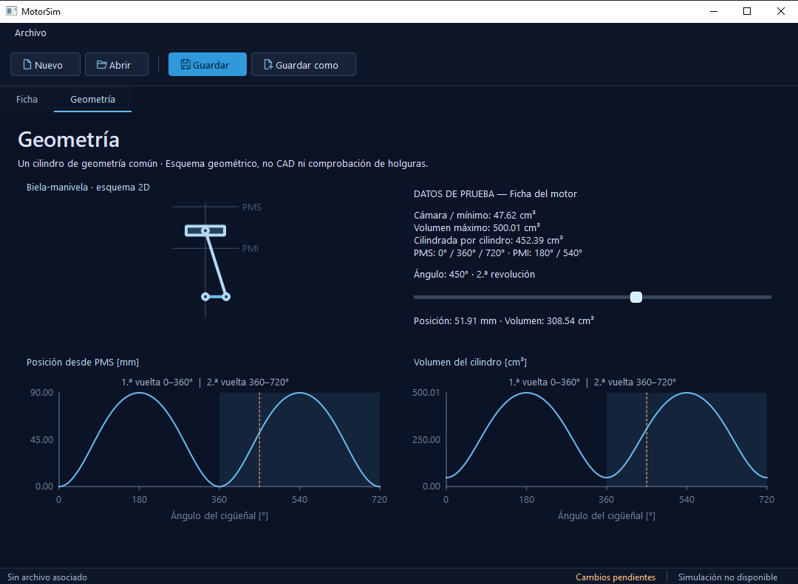
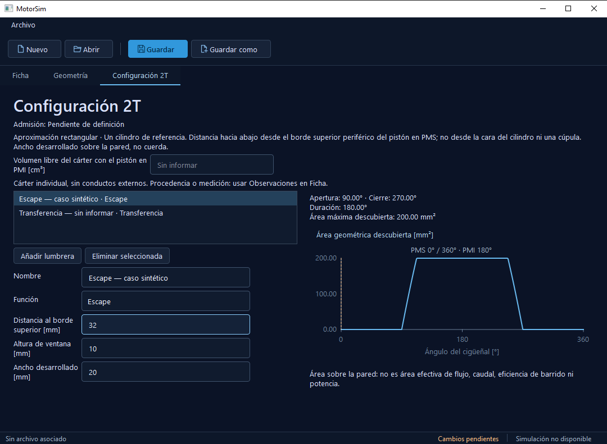
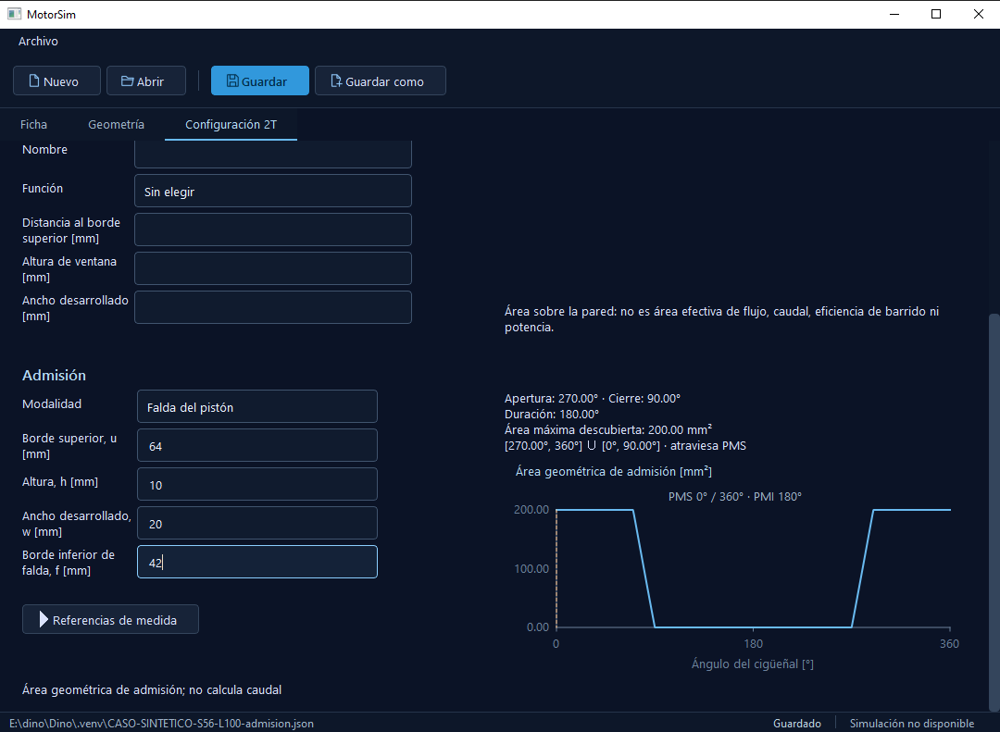
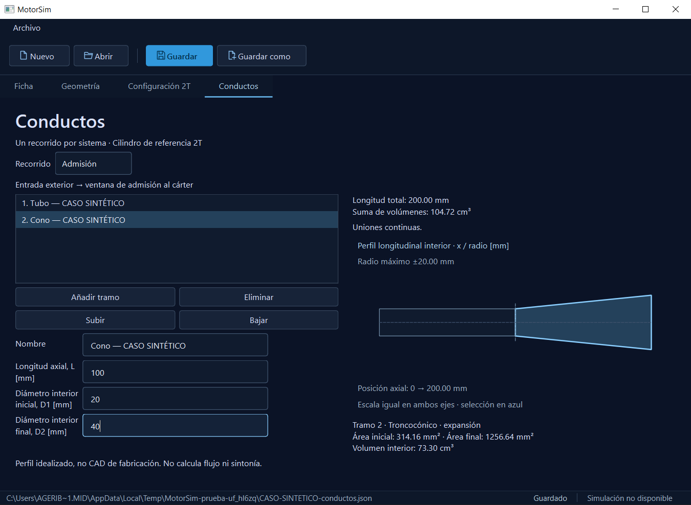

# MotorSim

P4: **P4_BLOCKED_WAVE_PHYSICS / SCIENTIFIC_CHANGE_REQUIRED**.
P3_HUMAN_ACCEPTED registrado y archivado; P0/P2/P3 congelados intactos.
P4A/E01–E05 PASS. P4B ejecutó16 casos individuales PASS, pero el refinamiento
100/200/400 de descarga incumple diferencias decrecientes de presión integrada
e intercambio de masa. Revisión independiente confirma fallo desde estados
finales, sin bug del agregador. No cambiar criterios ni repetir campañas para
forzar cierre. P4C no habilitado/implementado; sinP5, UI, JSON o publicación.
88 pruebas y regresiones offlineP0/P2/P3 PASS. [Decisión/evidencia](results/p4-exhaust-20260918/decision.json)
y [tareas y tablas](openspec/changes/p4-escape-1d/tasks.md). Preservar los fallos
nativos de infraestructura documentados; no son la causa del bloqueo científico.

Antecedente de autorización:

P3_HUMAN_ACCEPTED por orden cec0f5b3; baseline ec6ec55 congelado y cambio
archivado. Autorizado únicamente P4 experimental, cambio p4-escape-1d.
Sin reemplazarlegacy/UI/JSON; P4C sólo trasP4A/P4B PASS, sinP5 ni publicación.
Revisión independiente y STOP ante cambio científico necesario.

Antecedente histórico:

P3-R1: **P3_PASS_0D_1D_COUPLING_VERIFIED / WAITING_HUMAN_APPROVAL**.
Interfaz Riemann de cámara homogénea estancada, conservativa por etapa; C00/C00B
y C01–C12 PASS, adaptador de estado aislado2T/4T. 83 pruebas y regresiones
completas offline P0/P2 PASS; 27 hashes congelados intactos. Revisión científica
independiente PASS; aceptación humanaP3 pendiente. Sin conexión productiva,
P4, publicación ni archivo. [Evidencia y decisión](results/p3-r1-20260918/decision.json),
[definición](docs/gasdynamic/0d_1d_coupling_r1.md) y
[registro de casos](openspec/changes/archive/2026-09-18-p3-acoplamiento-conservativo/tasks.md).
Los gates nativos BLOCKED por falta de reviewer hook se conservan; el dictamen
independiente se adjunta separadamente. La orden38a85593 autoriza R1 y sustituye
sólo el cierreP3 reservoir, no las BC ni el núcleoP2.

Antecedente histórico (bloqueo anterior resuelto por nuevo objeto físico R1):

P3: **P3_BLOCKED_BACKFLOW / SCIENTIFIC_CHANGE_REQUIRED**.
P2_HUMAN_ACCEPTED registrado; núcleo y contratos congelados. El preflight
reproduce ausencia de rama/discontinuidad de reservoir al invertir flujo con
entropías distintas. No modificar la frontera para forzar avance sin decisión
científica. Interfaz preparatoria aislada, sin integración finita ni producto.
74 pruebas y regresiones offline P0/P2 PASS no acreditan P3. P3B/P3C pendientes;
sin P4, publicación o archivo. [Evidencia y bloqueo](results/p3-coupling-20260918/analysis.md).

Antecedente de autorización:

Orden a75bf738: **P2_HUMAN_ACCEPTED**, núcleo1D y contratos congelados.
Autorizado exclusivamente P3 aislado mediante dev_orchestrator. Preflight de
frontera reservoir antes de P3A; sólo P3A PASS habilita volumen finito/P3B,
y sólo volumen fijo PASS habilita P3C. Sin P4, producto, UI, JSON o publicación.
Cambio: openspec/changes/p3-acoplamiento-conservativo. Ante una incompatibilidad
del contrato congelado, SCIENTIFIC_CHANGE_REQUIRED, sin cambiar la BC.

Antecedente histórico:

P1-R5E: **P1_R5_PASS_CFL_SECOND_ORDER_CONTRACT**; adoptado R5 solo para
T11 segundo orden tras nueve finales y revisión científica independiente.
**P2_PASS_1D_CORE_VERIFIED / WAITING_HUMAN_APPROVAL**: T01–T12 PASS,
T12 10/10; 70 pruebas, siete regresiones históricas P0 offline, FIRST_ORDER/R4
preservado. T10 N800: 526,656 s; órdenes 400→800: rho 1,906602 / especie 1,906890;
T11 N1600/CFL 0,2: 304,844 s. Sólo dos integraciones nuevas, solver intacto.
Aceptación humana P2 pendiente; NO iniciar P3, archivar ni publicar.
Los gates nativos BLOCKED por falta de reviewer conectado se conservan;
[decisión derivada con revisión independiente](results/p1-r5e-20260918/decision.json)
y [tablas, delta y resultados](results/p1-r5e-20260918/analysis.md).

Antecedente histórico:

P1-R5 (orden350ec78f): **P1_R5_CFL_SECOND_ORDER_UNRESOLVED**.
Revisión offline de ocho finales y un parcial: SSP no implica monotonía CFL
entre mallas, pero falta N1600/CFL0,2 para justificar todas las cláusulas R5.
No se adopta R5; **P2_BLOCKED_SECOND_ORDER**. Fases B/C no habilitadas;
no nuevas integraciones, cambios de solver ni P3. R4 y presupuesto3/3 intactos.
[Análisis y tablas](results/p1-r5-cfl-20260918/analysis.md).

Antecedente histórico:

P2B reanudado con300s/caso: **P2_BLOCKED_SECOND_ORDER**.
T04–T09 aprobaron y T12 está **10/10 PASS**. T10_800 y T11 N1600/CFL0,2
agotaron300s. Además, la comparación completa CFL0,4/0,6 incumple R4:
la sensibilidad sube entreN400 yN800. El agregador ocultaba esa comparación
al faltar otro caso; se corrigió offline, con revisión independiente, sin cambiar
solver ni criterio. No hay PASS globalP2 ni autorizaciónP3. Presupuesto3/3.
60 pruebas pertinentes, siete regresiones P0 offline y hashes intactos.
[Resultado, tablas y corrección de revisión](openspec/changes/p2-nucleo-gas1d/tasks.md#reanudación-p2b-con-300-s--resultado).

Antecedente histórico de la primera implementación P2B:

P2B implementado en una ruta aislada **MUSCL/minmod + SSP-RK2**, con
`FIRST_ORDER` conservado. **FAILED_INFRASTRUCTURE**: la campaña se detuvo
al agotar T04 sus120s; no se declara P2B/P2 PASS. T01–T03 aprobaron;
T12 tiene cuatro subcasos aprobados, y los restantes gates están pendientes.
49 pruebas pertinentes y siete regresiones P0 offline PASS; revisión independiente
confirma el bloqueo. Una reparación de instrumentación CFL de tres permitidas,
sin cambiar integración ni tolerancias. P0, contratos anteriores, UI/JSON intactos.
**P1_R4_HUMAN_ACCEPTED** y **P2A_HUMAN_ACCEPTED** registrados por orden de
la usuaria; **no P2_HUMAN_ACCEPTED**. Sin P3, publicación ni archivo.
[Tablas, arquitectura, comandos y pendientes P2B](openspec/changes/p2-nucleo-gas1d/tasks.md#p2b--resultado-18092026).

Antecedente histórico P1-R4:

P1-R4: **P1_R4_PASS_T11_REFINED_CONTRACT** y
**P2A_PASS_FIRST_ORDER_VERIFIED** bajo
[1D_CONTRACT_V1_R4](docs/gasdynamic/1d_cfl_sensitivity_v1_r4.md).
Estudio12 casos N400/800/1600 y CFL0,1/0,2/0,4/0,6: sensibilidad decreciente,
estados admisibles y balances correctos; solver y contratos anteriores intactos.
R4 retira la garantía comparativa del8% en N800 y conserva exactitud T03,
añadiendo convergencia de sensibilidad y error. No se elevó0,08 a otro número.
Después: seis integraciones T11 deterministas y reevaluación de52 registros
(46 reutilizados con hashes) dan T01–T12 PASS; ocho pruebas pertinentes PASS.
Revisión independiente aprobada; aceptación humana de P2 pendiente.
P2B/P3 no iniciados. Sin publicación ni archivo.
[Tablas, fuentes, comandos y límites](openspec/changes/p1-r4-cfl/tasks.md).

Antecedente histórico P1-R3 (se conserva su fallo bajo aquel contrato):

P1-R3: **P1_R3_PASS_BOUNDARIES_SEPARATED**; contrato acústico
[1D_CONTRACT_V1_R3](docs/gasdynamic/1d_boundary_semantics_v1_r3.md).
T05 pressure-release aprobado sin modificar su tolerancia; NR01 independiente
registrado como diagnóstico. **P2A BLOCKED**: T01–T10/T12 PASS, pero T11 da
0,08336382706 >0,08 en sensibilidad de amplitud entre CFL0,6 y0,2.
Los52 casos individuales y25 pruebas unitarias aprobaron; eso no acredita P2A.
Revisión independiente confirma el incumplimiento. Reparaciones3/3 consumidas;
no cambiar CFL/umbral ni iniciar P2B/P3. Aceptación humana de P2 pendiente.
[Tablas, procedencia, comandos y pendientes](openspec/changes/p1-r3-fronteras/tasks.md).
[Delta contractual exacto](docs/gasdynamic/1d_contract_v1_r3_delta.json).
Producción0D/UI/JSON y contratos v1/R2 conservados. Sin publicar ni archivar.

Antecedentes históricos (sus STOP no se reescriben):

P1-R2: **P1_R2_PASS_CONTACT_OBSERVABLE**. Detector independiente de rho/p/u,
sin Y ni referencia exacta, aprobado en ocho soluciones preservadas y por revisión
independiente. Contrato [1D_CONTRACT_V1_R2](docs/gasdynamic/1d_contact_observable_v1_r2.md),
con único cambio del observable T02 y mismo límite2Δx; T06 intacto.
**P2A no reanudado:** T05 sigue bloqueado por ramas de frontera incompatibles,
confirmadas con70dígitos. Una excepción provisional de velocidadcero fue retirada;
su ensayo fallido no acredita T05. Retenidos fixes de contadores y exterior no
reflectivo. [Resultados y pendientes](openspec/changes/p1-r2-contacto/tasks.md).
24pruebas pertinentes PASS; no equivalen a T01–T12 completos. Sin P2B/P3.

Antecedente P1-R1: **P1_R1_CONTACT_ACCURACY_UNRESOLVED**. Estudio Sod y contacto puro
N200/400/800/1600 completado por dev_orchestrator. El cruce Y=0,5 en Sod N400
da error2,16805Δx >2Δx; no se adopta R1 ni se reanuda P2. Contrato y solver
intactos; [tablas y estado](openspec/changes/p1-r1-contacto/tasks.md),
[evidencia](results/p1-r1-contacto-20260917/artifacts/study.json).
Pruebas del observable: `.\.venv\Scripts\python.exe -m unittest discover -s tests -p test_p1_r1.py -v`.

P0: **P0_HUMAN_ACCEPTED**, aceptación de la usuaria registrada separadamente
sin cambiar el baseline NUMERICALLY_VERIFIED_BASELINE ni atribuir validación
experimental. P1 define el contrato quasi-1D en [docs/gasdynamic](docs/gasdynamic/1d_mathematical_contract_v1.md),
con [plan T01–T12](docs/gasdynamic/1d_verification_plan_v1.md) y manifest.
P1: **P1_HUMAN_ACCEPTED**, contrato congelado para P2.
Antecedente P2 anterior a R2: **SCIENTIFIC_CHANGE_REQUIRED**; núcleo first-order aislado implementado pero
no aprobado. Sod incumple la localización contractual del contacto; T05 también
falla por selección de rama cerca del reposo. Campaña detenida: T08 parcial,
T09–T12 sin ejecutar, P2B/P3 sin iniciar. Producción 0D/UI/JSON intactos.
Evidencia y defectos pendientes en [tareas P2](openspec/changes/p2-nucleo-gas1d/tasks.md).
Pruebas unitarias: `.\.venv\Scripts\python.exe -m unittest discover -s tests -p test_gas1d.py -v`.
No relanzar campaña ni cambiar P1 para superar el bloqueo sin nueva autorización.
El estado/evidencia histórica de P1 se
registra en [sus tareas](openspec/changes/p1-contrato-gas1d/tasks.md).
Checks documentales: `.\.venv\Scripts\python.exe -m unittest discover -s tests -p test_p1_contract.py -v`.

Editor de proyectos y ficha del motor en Python + PySide6/Qt Widgets. La entrega geométrica 2T previa
[conductos-admision-escape](openspec/changes/conductos-admision-escape/specs/conductos-admision-escape/spec.md)
añade recorridos geométricos de conductos circulares de admisión y escape 2T.
La ficha, posición del pistón, volúmenes y curvas geométricas existentes se conservan.
La pestaña Simulación admite los casos sintéticos 2T/4T y geometría del
proyecto bajo las mismas condiciones de referencia, dentro del dominio 0D definido.

Estado de las entregas 1 y 2: **Completadas**. La usuaria comunicó el 14/09/2026
que realizó las comprobaciones manuales pendientes, incluido el uso sin Internet,
y aceptó ambas entregas. No quedan otros criterios obligatorios pendientes según
las tareas existentes. La [hoja de ruta](docs/HOJA_DE_RUTA_MotorSim.md#estado-de-avance)
resume el estado. Esta aceptación es evidencia de la usuaria, separada de las
pruebas automatizadas e inspección visual del agente. Sin archivar. La entrega 3
está **Completada** para la configuración geométrica admitida: lumbreras, cárter
y admisión por falda comprobados. Esto no es aceptación manual de la usuaria
ni validación predictiva. La entrega 4 está **Completada** para el editor geométrico autorizado el 15/09/2026.
La entrega 5 está **implementada para este alcance 0D acotado**; evidencia de cierre abajo.
Aceptación manual de la usuaria pendiente y separada; no se atribuye validación experimental.
La usuaria aprobó el modelo 0D, caso y protocolo de
[simulacion-2t](openspec/changes/simulacion-2t/design.md) para esta prueba de consola.
La integración Qt conserva las condiciones del caso de referencia, sin cambios en JSON v5. Sin ondas, inercia de conductos,
sintonía, combustión predictiva ni validación experimental.

## Rendimiento indicado — candidata rc6

## Ampliación pública autorizada después de P0 — 17/09/2026
La aplicación admite **2T 2500–15000 rpm** y conserva **4T 2500–3500 rpm**.
Simulación y Rendimiento usan el mismo validador. Los barridos mantienen 2–5
puntos y 300 s acumulados; ejemplo: Inicio=5000, Final=15000, Incremento=2500.
16000–20000 siguen excluidos. P0 acredita la malla del caso sintético, sin
validación experimental. Solver, tolerancias y formatos sin cambios.
Esta autorización posterior no modifica las conclusiones históricas anteriores.
No se reconstruye EXE: las candidatas previas conservan sus límites.
Ejecutar la fuente actual: `.\.venv\Scripts\python.exe -m motorsim`.

Antecedente histórico anterior a P0:

Ampliación candidata2T1000–15000 (17/09/2026): **fase A BLOCKED**. A1000rpm
se alcanzó el mínimo de paso antes de un ciclo; a2000rpm hubo ocho rechazos
no físicos en el sexto ciclo. Convergieron3000/5000/8000/10000/12000/15000;
estos puntos aislados no acreditan un intervalo continuo. La aplicación conserva
2500–3500rpm y2–5puntos, tanto2T como4T. No se modificaron física, tolerancias,
presupuesto, formatos ni candidatas. No se ejecutaron29puntos ni exploración
16000–20000 porque requieren GO. Tabla y evidencia en
[tareas](openspec/changes/rendimiento-indicado/tasks.md).
66 pruebas pertinentes aprobadas, OpenSpec estricto y revisión independiente
puntual sin defectos. Regresión 2T3000 exactamente igual al histórico, incluidas
las muestras; lectores2T/4T compatibles. Sin nueva inspección Windows ni
aceptación manual atribuida. Cancelación/recálculo conservados y probados con
dobles; barrido largo no habilitado.
Reproducir exclusivamente la fase A autorizada, en una carpeta nueva:
`.\.venv\Scripts\python.exe -m tools.verify_2t_rpm_domain --output <carpeta nueva>`.
Prueba de contrato y regresión sin integrar:
`.\.venv\Scripts\python.exe -m unittest discover -s tests -p test_rpm_domain.py -v`.

El modelo actual es0D y no resuelve propagación/reflexión de ondas ni resonancia
del escape. La curva no representa todavía la respuesta de un escape2T sintonizado.
Es comprobación numérica, no validación física ni experimental.

CÁLCULO → Rendimiento reutiliza automáticamente la curva compatible del proyecto.
Inicio/Final/Incremento permanecen disponibles después de obtener una curva.
Sin curva ofrece **Calcular rendimiento** y con ella **Recalcular rendimiento**: acción explícita
que invoca el mismo barrido de Simulación. Entrar o cargar un ejemplo no ejecuta
nada ni abre un diálogo. Muestra progreso y Cancelar; al finalizar presenta la
curva sin seleccionar archivos. También reutiliza barridos hechos en Simulación.
Cambiar el proyecto retira las curvas incompatibles sin borrar resultados.
Cambiar solo RPM conserva la curva, compara el plan exacto y muestra una advertencia
con las RPM anteriores y las nuevas. Durante recálculo bloquea los campos y presenta
el resultado anterior identificado; al terminar correctamente lo sustituye. Cancelar
o fallar conserva la curva y el plan configurado, permite reintentar y nunca
sobrescribe carpetas anteriores. Un plan inválido deshabilita el cálculo.
**Abrir barrido existente…** permite análisis histórico explícitamente identificado.
Los derivados siguen usando exclusivamente las entradas guardadas. Presenta potencia indicada [kW]
y par indicado equivalente [N·m], puntos reales y segmentos rectos, selección
por clic/teclado, tabla y acceso a Resultados. Los huecos no se unen. Los mayores
valores corresponden únicamente a los puntos calculados del barrido.

La función común `motorsim.performance.indicated_output` usa W_C/RPM/ciclo
guardados: 2T P=W_C·rpm/60, T=W_C/(2π); 4T P=W_C·rpm/120, T=W_C/(4π).
No reintegra p·dV. No incluye fricción ni pérdidas mecánicas ni valores al eje.
Resultados individuales y Comparar muestran estos derivados; CSV nuevos incluyen
`indicated_power_W` y `indicated_torque_Nm` sin redondear. Los originales no se reescriben.

Pruebas pertinentes, incluida analítica independiente e históricos sin solver:
```powershell
.\.venv\Scripts\python.exe -m unittest discover -s tests -p test_performance.py -v
.\.venv\Scripts\python.exe -m unittest discover -s tests -v
openspec validate rendimiento-indicado --strict --no-interactive
```
Diez pruebas nuevas aprobadas; revisión independiente puntual sin defectos
concretos. Recorridos Windows automatizados al 100/125/150 % con históricos
2T/4T aprobados, separados de la inspección visual y de la aceptación manual
pendiente. Detalle y evidencia en
[tasks.md](openspec/changes/rendimiento-indicado/tasks.md).
Sin cambios físicos, nuevas integraciones ni campañas. rc5 se conserva.

El flujo corregido está en fuentes; iniciar con `.\.venv\Scripts\python.exe -m motorsim`
desde la raíz del repositorio. No se construyó rc7 ni se reemplazó el ZIP rc6.
La candidata original documentada a continuación todavía tiene el flujo anterior.
Recorrido de revisión del recálculo (realizar una vez con cada ejemplo Referencia,
2T y4T): calcular Inicio2500/Final3500/Incremento500; comprobar tres puntos y
controles visibles. Cambiar Final a3000, comprobar aviso y curva anterior,
recalcular y comprobar dos puntos. Cambiar Final de nuevo a3500, iniciar y
cancelar; deben conservarse los dos puntos y el nuevo plan. Volver a pulsar
Recalcular y comprobar tres puntos. Todo en Rendimiento, sin recargar proyecto
ni borrar archivos. Cada ejecución genera una carpeta nueva.
Recálculo iterativo comprobado: **281 pruebas aprobadas**, OpenSpec estricto y
revisión independiente puntual (cancelación tardía corregida). Recorrido Windows
automatizado por cada ciclo: tres cálculos completos, cambio de plan, cancelación
y reintento; seis barridos convergidos en total. Archivos anteriores conservados.
[Capturas y evidencia del recálculo](results/rendimiento-iterativo-rc6-20260917/evidence.json).
Inspección visual del agente separada de aceptación manual, pendiente. Sin rc7.

Comprobación inicial de d15ec98: suite274 aprobada y16pruebas afectadas posteriores
(incluida recuperación tras cancelar sin curva) aprobadas. Windows visible automatizado:
barrido2T desde Rendimiento y4T desde Simulación, ambos convergidos y presentados
automáticamente; cancelación cooperativa por separado. Revisión independiente
detectó el caso de reintento tras cancelar, corregido y comprobado. Inspección
visual del agente separada de aceptación manual, que sigue pendiente.
[Capturas y evidencia de la corrección](results/rendimiento-ux-rc6-20260917/evidence.json).

rc6 original comprobada: fuente `799b7d6f9bf6b0061bd9a1de60af682e8061630a`, construida
desde checkout limpio con Python3.11.0/PySide6 6.11.2/PyInstaller6.22.3.
Suite269 aprobada (54,860s);10tests afectados posteriores también aprobados.
EXE directo, cwd diferente y PATH solo sistema: barridos2T/4T, gráfico/tabla,
punto individual, reutilización, comparación y CSV aprobados sin worker.
[Captura del EXE](results/rendimiento-rc6-20260917/rc6-4T-combinado.png),
[evidencia](results/rendimiento-rc6-20260917/evidence.json).

```powershell
& 'E:\MotorSim distribucion\Candidata Rendimiento 0.1.0-rc6\MotorSim\MotorSim.exe'
```
ZIP: `dist/MotorSim-0.1.0-rc6-windows-x64-799b7d6f.zip` (43.440.060bytes).
SHA256: `0b5d8eaa46a5c82ff2ae82305ed5846467197c4c53b58ff80ef2198dd93e2db1`.
162archivos extraídos verificados contra ZIP; rc5 intacta. Aceptación manual
pendiente; sin validación experimental, publicación ni archivo del cambio.

## Interfaz CAE — candidata rc5 (evidencia anterior)

La referencia visual confirmada se adapta a Qt Widgets: paleta técnica común,
paneles compactos, Resumen bilateral y Simulación con preparación, estado real y
contexto colapsable. Los ocho espacios conservan sus controles y reglas. Los ejes
vacíos no muestran presiones ficticias; las curvas usan muestras reales en orden
temporal. El selector de Resumen abre copias de los cuatro JSON incluidos: sin
ruta, con cambios pendientes y Guardar como obligatorio. No ejecuta ni abre resultados.

Python 3.11.0, PySide6 6.11.2 y OpenSpec 1.3.1 disponibles. Sin dependencias nuevas.
Comprobación automática: 258 pruebas aprobadas antes de la corrección puntual de
Detalles; comprobaciones afectadas posteriores registradas en
[tasks.md](openspec/changes/implementacion-ui-cae-final/tasks.md).
OpenSpec estricto aprobado. Revisión independiente puntual detectó y permitió
corregir un fallo de Detalles; autorrevisión visual separada. Capturas Windows
automatizadas al 100/125/150 %, sin atribuir aceptación manual. El monitor físico
1440×900 limita el recorrido Full HD; se comprueban anchos lógicos de hasta 1920.
Candidata final: fuente `8cbd0bfe580e4221f0f1d496bb9f0429827e3d73` (incluye
la implementación `5ee49e21` y la corrección de aviso compacto). Construida desde
checkout limpio; Python 3.11.0 / PySide6 6.11.2 / PyInstaller 6.22.3.
Recorrido automatizado del EXE aprobado: cuatro copias JSON, Guardar como y
reapertura Unicode, navegación, dos puntos, cancelación, resultados/barrido
histórico, comparación y CSV/importación/contraste. 2T: 10 ciclos, 13,516 s;
4T: 7 ciclos, 14,594 s. Campos científicos y muestras exactamente iguales a
referencias preservadas; tiempos/memoria/identificadores no son datos deterministas.
Cancelación cooperativa: 0,187 s. Sin otras integraciones ni campañas.

[Captura real del paquete](results/ui-cae-rc5-20260917/rc5-resumen-4t-reference.png)
y [comparación numérica](results/ui-cae-rc5-20260917/exact-comparison.json).
Capturas completas: `E:\MotorSim distribucion\Comprobación CAE rc5` y
`E:\MotorSim distribucion\UI CAE rc5`. Escalado Qt 100/125/150 % sobre Windows;
no se cambiaron políticas ni configuración global de pantalla.

Abrir la candidata comprobada:
```powershell
& 'E:\MotorSim distribucion\Candidata CAE 0.1.0-rc5\MotorSim\MotorSim.exe'
```
ZIP: `dist/MotorSim-0.1.0-rc5-windows-x64-8cbd0bfe.zip`, 43.420.101 bytes.
SHA256: `f3159c9dd91ddf64e7b02901a9488e6eea60f4c9346eed768bbf2e4f835c9d18`.
162 archivos extraídos idénticos al ZIP tras las comprobaciones. rc1–rc4 intactas.
Aceptación manual, Full HD físico y equipo sin Python/offline aislado permanecen
por verificar. No se atribuye validación experimental.

Comandos desde la raíz:
```powershell
.\.venv\Scripts\python.exe -m motorsim
.\.venv\Scripts\python.exe -m unittest discover -s tests
openspec validate implementacion-ui-cae-final --strict --no-interactive
.\.venv-build\Scripts\python.exe packaging/build_windows.py
```
La construcción final requiere fuente registrada en Git y árbol limpio. rc1–rc4 se
conservan. La integración automática de OpenSpec y los prompts globales siguen
sin modificarse. No archivar; aceptación manual final pendiente.

## Proyectos de ejemplo

Los cuatro JSON físicos están en `examples/projects/`: referencias 2T/4T y sus
variantes COMPRESION_8_2. Abrilos mediante **Archivo → Abrir** y usá **Guardar como**
para conservar el original. Son proyectos sintéticos, no motores medidos ni
validados experimentalmente. Referencia frente a 8.2 permite preparar una
comparación; no contiene resultados precalculados. Cada pareja difiere únicamente
en `compression_ratio`; conserva el mismo nombre y observaciones deliberadamente.

- [2T referencia](examples/projects/EJEMPLO_SINTETICO_2T_REFERENCIA.json)
- [2T compresión 8.2](examples/projects/EJEMPLO_SINTETICO_2T_COMPRESION_8_2.json)
- [4T referencia](examples/projects/EJEMPLO_SINTETICO_4T_REFERENCIA.json)
- [4T compresión 8.2](examples/projects/EJEMPLO_SINTETICO_4T_COMPRESION_8_2.json)

Regenerar: `.\.venv\Scripts\python.exe tools/generate_example_projects.py`.
Comprobar: `.\.venv\Scripts\python.exe -m unittest discover -s tests -p "test_example*.py"`.
La receta de Windows incluye los mismos archivos bajo `MotorSim/Ejemplos/`;
su apertura no depende del repositorio. El menú Cargar ejemplo previo se conserva
con su identificación propia y carga como copia nueva sin ruta.

Candidata con archivos físicos: fuente `8d6f41dc08f113e3c60503420b7a798b2d9721c4`;
ZIP `dist/MotorSim-0.1.0-rc4-windows-x64-8d6f41dc.zip`. Los cuatro archivos están
en `MotorSim/Ejemplos/`, idénticos a los versionados. Carpeta comprobada:
`E:\MotorSim distribucion\Candidata JSON físicos rc4\MotorSim\Ejemplos`.
Abrir `MotorSim.exe` en la carpeta superior. 11 pruebas pertinentes, OpenSpec
estricto y revisión independiente aprobados. Apertura 2T/4T, entradas y Guardar
como comprobados por automatización visible del EXE; originales intactos, sin solver.
Capturas: `E:\MotorSim distribucion\JSON físicos paquete`. No es aceptación manual.

## Refinamiento visual — rc4 previa conservada

`refinamiento-ui-final` conserva la navegación permanente por proyecto,
configuración, cálculo y análisis. Las ocho vistas usan encabezados claros y
paneles de entrada, estado y consulta: Resumen operativo; Geometría con derivados
junto al esquema; motores con contexto del ciclo; Simulación con preparación y
resultado separados; Resultados con fuente y pestañas; Comparar con A/B y
compatibilidad; Datos externos con importación, barrido, contraste y exportación.
Los paneles se apilan en anchos reducidos. Física, worker, JSON v6, CSV y reglas
de ejecución/comparación permanecen intactos.

247 pruebas aprobadas; OpenSpec estricto y revisión independiente puntual sin
defectos identificados. Inspección de ventanas Qt Windows reales al 100/125/150 %,
incluidos estados vacíos e históricos. Evidencia y límites en
[tasks.md](openspec/changes/refinamiento-ui-final/tasks.md). El monitor disponible
es 1440×900: la captura de ancho 1920 no acredita un escritorio físico Full HD.
Aceptación manual final pendiente. Fuente de la nueva rc4:
`d6c4e19b03692ba22301045ed2206da5081b5ac9`, árbol limpio al construir.
Python 3.11.0, PySide6 6.11.2, PyInstaller 6.22.3; sin nuevas dependencias.
Recorrido automatizado del EXE aprobado: guardar/reabrir, cuatro ejemplos y
protección de cambios, punto 2T convergido, cancelación cooperativa, resultados,
barrido histórico, comparación y CSV/importación/contraste. Ocho vistas del EXE
inspeccionadas al 100 % y recorrido operativo al 150 %. No es aceptación manual.

Abrir la candidata comprobada:
```powershell
& 'E:\MotorSim distribucion\Candidata refinada á 0.1.0-rc4\MotorSim\MotorSim.exe'
```
ZIP: `dist/MotorSim-0.1.0-rc4-windows-x64-d6c4e19b.zip`, 43.407.420 bytes.
SHA256: `e4dee7c4469e0d80b7b8ec57ae19d30de86b14851976b35da16fe711d90278c9`.
Capturas reales y registros: `E:\MotorSim distribucion\Comprobación refinamiento rc4`;
por ejemplo `rc4-Resumen-1.png` y `rc4-Datos externos-1.png`.
Las rc3 y rc4 anterior conservan sus hashes. Equipo sin Python/offline aislado y
pantalla física Full HD siguen por verificar; sin archivo ni validación experimental.

Reproducir pruebas: `.\.venv\Scripts\python.exe -m unittest discover -s tests`;
`openspec validate refinamiento-ui-final --strict --no-interactive`.
Construir desde fuente limpia: `.\.venv-build\Scripts\python.exe packaging/build_windows.py`.

## Ejemplos precargados — rc4 anterior conservada

Archivo → Cargar ejemplo ofrece **2T referencia**, **2T compresión 8.2**,
**4T referencia** y **4T compresión 8.2**. Todos llevan
**EJEMPLO SINTÉTICO — NO MEDIDO** en nombre y observaciones: no son motores
calibrados ni validados experimentalmente. Se generan desde las mismas definiciones
canónicas acreditadas; las variantes solo cambian compresión de 8.0 a 8.2.

Cargar crea una copia editable, sin archivo asociado y con cambios pendientes.
Guardar solicita destino; el paquete no se sobrescribe. Si había cambios, se usa
la confirmación habitual Guardar/Descartar/Cancelar. La próxima simulación queda
en Proyecto actual y utiliza los valores cargados. No carga resultados como recién
calculados; los resultados ya abiertos conservan su identidad y procedencia.
Los mismos cuatro JSON se incluyen en la carpeta Ejemplos, pero la acción del menú
no depende de archivos externos, red, repositorio ni carpeta actual.

Pruebas y evidencia en [ejemplos-precargados/tasks.md](openspec/changes/ejemplos-precargados/tasks.md).
Comandos: `.\.venv\Scripts\python.exe -m unittest discover -s tests` y
`openspec validate ejemplos-precargados --strict --no-interactive`.
**rc4 construida y comprobada**, fuente limpia
`4e7e559f61d7b19349e0eb37258340c78097451f`. Python 3.11.0, PySide6 6.11.2 y
PyInstaller 6.22.3, sin actualizar dependencias. 245 pruebas aprobadas y 7 pruebas
específicas repetidas tras el ajuste de la cabecera; OpenSpec estricto y revisión
independiente puntual sin defectos identificados.

Windows automatizado del EXE al 150 %: cuatro ejemplos, guardado de referencias,
Cancelar/Descartar, navegación, estado pendiente/sin ruta, comprobación de entradas
8.2 y consulta explícita de un resultado histórico. Captura real inspeccionada y
evidencia en `E:\MotorSim distribucion\Comprobación final rc4`. Cero integraciones
nuevas; comparación por fixtures, sin campañas ni aceptación manual atribuida.
Los cuatro recursos se comprobaron idénticos a las definiciones y al ZIP original.

ZIP: `dist/MotorSim-0.1.0-rc4-windows-x64-4e7e559f.zip`, 43.396.571 bytes;
carpeta 104.894.037 bytes. SHA256:
`17bcefc76b6275ca36c19068882cc026b878e8db55b7f5099f219ced305841a4`.
Reconstrucción: `.\.venv-build\Scripts\python.exe packaging/build_windows.py`
desde commit limpio con entorno fijado. Abrir la extracción comprobada:

```powershell
& 'E:\MotorSim distribucion\Candidata final á 0.1.0-rc4\MotorSim\MotorSim.exe'
```

rc3 conservada con hash intacto. Aceptación manual final y pendientes anteriores
de distribución/validación experimental permanecen abiertos. Sin publicar ni archivar.

## Navegación por tareas — candidata 0.1.0-rc3 (conservada)

`reorganizacion-ui-final` reorganiza la interfaz existente, sin modificar física,
solver, worker, límites, JSON v6 ni contratos/CSV. La columna permanente separa
Resumen, Geometría, Motor 2T/4T, Simulación, Resultados, Comparar y Datos externos.
Solo se muestra el motor del ciclo activo. Resumen → Datos del proyecto conserva
la edición común; Geometría reúne formulario y gráficos. Cada motor agrupa sus
editores y conductos. Resultados reutiliza el panel actual y permite consultar
puntos de barridos; comparación e importación se integran sin ventanas separadas.
Archivo conserva todas sus acciones; la barra rápida muestra Nuevo/Abrir/Guardar.

Pruebas automáticas: 238 aprobadas; cobertura anterior conservada, regresiones de navegación,
borradores/ciclo, ejecutabilidad, teclado/Escape, cálculo activo, resultados
independientes e importación embebida. Comando: `.\.venv\Scripts\python.exe -m unittest discover -s tests`.
Validación: `openspec validate reorganizacion-ui-final --strict --no-interactive`.
Revisión independiente puntual y correcciones comprobadas; sin nueva física.

Inspección Windows automatizada con capturas nativas Qt, realmente revisadas,
en `E:\MotorSim distribucion\UX final`: 100 %, 125 % y 150 %, anchos lógicos
900/1092/1366/1920 según caso. El escritorio disponible es 1440×900: el ancho
1920 se capturó mediante QWidget.grab; Windows limitó su altura a 881. Esto no
acredita un escritorio físico 1920×1080. Las vistas compactas usan scroll local.
Resultados históricos y CSV explícitamente sintético, sin recalcular campañas.
Evidencia y pendientes detallados en [tasks.md](openspec/changes/reorganizacion-ui-final/tasks.md).

rc3 distingue este rediseño de la rc2 existente; ambas candidatas anteriores se
conservan. **Construida desde `16097c43628fb523107aa8c661d7ea459db92432`, limpio**,
con Python 3.11.0, PySide6 6.11.2 y PyInstaller 6.22.3 sin actualizar dependencias.
ZIP: `dist/MotorSim-0.1.0-rc3-windows-x64-16097c43.zip`, 43.396.296 bytes;
carpeta 104.887.479 bytes. SHA256:
`da355109e4126ab58e62b2016ab55b68e828622b69563ff0f52da9a7e7577ae2`.
Reconstrucción: `.\.venv-build\Scripts\python.exe packaging/build_windows.py`
desde un commit limpio, conservando la receta fijada; no sobrescribe destinos.

EXE extraído comprobado mediante teclado/UIA en Windows real al 150 %: guardar/
reabrir, navegación 4T, resultado/barrido histórico y consulta de punto, comparación
y exportación CSV, importación sintética/contraste y exportación, un punto 2T
B100/3000 convergido y cancelación cooperativa. El punto conserva exactamente
entradas, ciclos y muestras numéricas frente a rc2 (identificador de ejecución,
reloj y memoria separados). Integración 13,469 s + cancelación 0,250 s; sin campañas.
Capturas del EXE y evidencia: `E:\MotorSim distribucion\Comprobación final rc3`.
La automatización del recorrido se adaptó a teclado real: UIA Select por sí solo
no cambia la página actual de QTreeWidget. No requirió cambios del paquete.

Abrir la extracción comprobada:

```powershell
& 'E:\MotorSim distribucion\Candidata final á 0.1.0-rc3\MotorSim\MotorSim.exe'
```

Aceptación manual final, equipo sin Python, offline aislado y validación
experimental siguen separados y pendientes. No se archiva ni publica.

## Hardening Windows 0.1.0-rc2 (evidencia anterior conservada)

Continuación en el mismo cambio distribucion-windows. Conserva la rc1 siguiente
como referencia histórica. rc2 registra tiempos opcionales en los resultados
nuevos 2T v1 mediante el contrato existente; no modifica proyectos JSON v6,
modelos, física ni archivos anteriores. La GUI añade tiempo percibido solo al
resultado recién confirmado por su worker, nunca por abrir un histórico.
La parada de seguridad mantiene 3 segundos y conserva diagnóstico local adicional.

El incidente rc1 se clasifica **F: evidencia insuficiente**: referencia admitida,
cancelación durante inspección de módulos; una única reproducción terminó
cooperativamente. Faltan traza del worker durante el retraso original y sus tiempos
de escritura/IPC. No se declara resuelto ni se amplía el dominio para evitarlo.
**rc2 construida y comprobada** desde fuente limpia
`580c3f8e6bf816aaeef9f20f17a9b74a7d481df8`. Windows 10 19045 x64,
Python 3.11.0, PySide6 6.11.2, PyInstaller 6.22.3; dependencias fijadas sin actualizar.

- Carpeta: `E:\dino\Dino\dist\MotorSim-0.1.0-rc2-windows-x64-580c3f8e\MotorSim`.
- Ejecutable: `MotorSim.exe` dentro de esa carpeta, junto al worker y `_internal`.
- ZIP: `E:\dino\Dino\dist\MotorSim-0.1.0-rc2-windows-x64-580c3f8e.zip`.
- ZIP **43.376.832 bytes**, carpeta **104.867.659 bytes**, no firmado.
- SHA256: `9686135082d2854e1ed7aa653cf21645317f2474bcede8d52f44085fe68a1b35`.

Reconstrucción comprobada: `.\.venv-build\Scripts\python.exe packaging/build_windows.py`
desde la raíz limpia con el entorno fijado abajo. Rechaza destinos existentes.
Abrir la extracción realmente comprobada:

```powershell
& 'E:\MotorSim distribucion\Candidata final á 0.1.0-rc2\MotorSim\MotorSim.exe'
```

**Pruebas:** 228 aprobadas; OpenSpec estricto y revisión independiente puntual.
Un único punto completo 2T y otro 4T B100/3000 desde rc2: 10/7 ciclos, igualdad
exacta con referencias, balances aprobados. Integración 13,843/14,609 s; escritura
0,157/0,234 s; preparación 0,000/0,000 s a la resolución del reloj; total de punto
14,125/14,937 s; percibido 14,890/15,406 s. Preparación no incluye todo el arranque
del proceso, que sí está incluido en el tiempo percibido; cero medido no significa
costo nulo. No se reconstruyeron tiempos históricos.

**Windows automatizado:** EXE directo, ruta Unicode externa al repo, cwd distinto,
PATH solo Windows, sin variables Python de desarrollo. Módulos cargados acreditan
GUI/worker y Python DLL dentro del paquete; worker sin Qt ni consola visible.
Editor/guardado/alternancia, cancelación breve cooperativa (0,235 s), cierre sin
huérfanos, reapertura, comparación, barrido histórico, datos externos sintéticos/CSV,
auxiliar ausente y resultado corrupto comprobados. Error de permisos y FailedToStart
cubiertos por pruebas controladas, sin alterar permisos reales del equipo.
Inspección de capturas reales al 150 %, sin otra revisión estética.
Evidencia: `E:\MotorSim distribucion\Comprobación final rc2`; captura de tiempos:
`rc2-tiempos-final-150.png`. La automatización usa Python para controlar ventanas,
pero GUI y cálculo se ejecutan con los binarios y runtime incluidos.

**Cierre técnico parcial:** tiempos futuros corregidos y distribución rc2 probada;
causa del incidente rc1 aún **F**, no resuelta. No se identificaron otros defectos
reproducibles en el alcance comprobado. Equipo sin Python, offline aislado,
aceptación manual y validación experimental siguen pendientes y separados.
No se alteró la red ni se publicaron artefactos. Detalle en tasks.md.

## Referencia histórica: candidata Windows 0.1.0-rc1

Cambio activo: [distribucion-windows](openspec/changes/distribucion-windows/tasks.md).
Paquete Windows x64 **onedir**: extraer la carpeta completa y abrir `MotorSim.exe`.
`MotorSimWorker.exe` y `_internal` deben permanecer juntos. No requiere activar
un entorno ni instalar Python. `LEEME.txt`, `Ejemplos/` y `Licencias/` acompañan
la carpeta. Los ejemplos se generan desde las referencias y son sintéticos.
No firmado, sin instalador, actualizador, asociación global ni funciones físicas nuevas.

**Construcción** (Windows x64, Python 3.11.0; entorno operativo conservado):

```powershell
cd E:\dino\Dino
.\.venv\Scripts\python.exe -m venv .venv-build
.\.venv-build\Scripts\python.exe -m pip install -r packaging/requirements-build.txt
.\.venv-build\Scripts\python.exe packaging/build_windows.py
```

El comando final exige Git limpio, versiones fijadas y destino nuevo. No borra
construcciones ni datos. Produce carpeta, ZIP y SHA256 en `dist/`, identificados por
versión y commit. `build.json` incluido registra fuente, arquitectura, runtime y
herramientas; Acerca de muestra versión/commit sin Git ni Internet. La versión de
producto es independiente de JSON v6, modelos y contratos de resultados.
Receta [PyInstaller onedir](https://pyinstaller.org/en/stable/spec-files.html), con
GUI windowed y auxiliar console conectado por QProcess sin shell.

Resultados: `%LOCALAPPDATA%\MotorSim\Resultados`; errores inesperados:
`%LOCALAPPDATA%\MotorSim\Diagnostico`. Proyectos/exportaciones/importaciones
respetan el destino elegido. Mover o sustituir el paquete no migra esos datos.
No se escriben en `_internal` ni se envían a ningún servicio.

**Candidata construida y probada:** fuente limpia
`f46613e4ae9a82dc394db8b6509e782c2121cc3c`, Windows 10 19045 x64,
Python 3.11.0, PySide6 6.11.2, PyInstaller 6.22.3. Dependencias completas en
`packaging/requirements-build.txt` y `build.json`. El commit posterior registra
solo evidencia/documentación y automatización externa; no modifica el binario.

- Ejecutable construido: `E:\dino\Dino\dist\MotorSim-0.1.0-rc1-windows-x64-f46613e4\MotorSim\MotorSim.exe`.
- ZIP: `E:\dino\Dino\dist\MotorSim-0.1.0-rc1-windows-x64-f46613e4.zip`.
- ZIP: **43.376.903 bytes**; carpeta: **104.867.240 bytes**; ejecutable no firmado.
- SHA-256: `19eeec5047c9f9f5eab22d7938b9680539e5660649659cb209060ec8b4486d6b`.

Apertura del ZIP extraído que se comprobó:

```powershell
& 'E:\MotorSim distribucion\Candidata final á 0.1.0-rc1\MotorSim\MotorSim.exe'
```

**Pruebas automatizadas:** 224 aprobadas (36,193 s) y revisión independiente
puntual sin defectos reproducibles. El EXE extraído se probó mediante UIA/teclado:
edición, JSON incompleto/inválido/antiguo, alternancia, protección, ayuda, lectores,
comparación, importación sintética y CSV. Tres puntos convergieron con igualdad
numérica exacta respecto de las referencias: 2T B3000 (10 ciclos), 4T B2500/B3000
(7 ciclos cada uno). Sin repetir puntos ni cambiar física/tolerancias.
Dos cancelaciones cooperativas (botón/cierre) pasaron sin huérfanos. Una tercera
comprobación de módulos activó la parada de seguridad a los 3 s: cancelado, sin
resultado aceptado ni manifiesto final; causa del retraso no determinada.

GUI/worker y sus DLL Python se verificaron dentro del paquete; worker sin Qt,
sin consola visible durante la comprobación, cwd ajeno, PATH solo Windows y sin
PYTHONPATH/VIRTUAL_ENV. La automatización externa usa Python, la aplicación no
utiliza ese intérprete. La extracción mantiene los hashes de los 160 archivos
originales; sin entornos, repositorio, resultados históricos ni herramientas UIA.

**Inspección visual:** capturas reales del EXE a escala Qt efectiva 150 %, formulario
adaptable y ventana compacta 1000×740; navegación por teclado a la pestaña final.
Capturas y evidencia: `E:\MotorSim distribucion\Comprobación final rc1`.
Se inspeccionaron editor, compacto, barrido, importación y Acerca de. No es
aceptación manual de la usuaria.

**Por verificar:** equipo Windows sin Python instalado y ejecución offline aislada;
no se dispone de ese entorno y no se alteró la red. También falta el desglose temporal
del punto 2T: su contrato v1 no conserva preparación/escritura/tiempo percibido.
Se conserva la integración medida, sin inventar valores ni repetir el punto para
suplir el registro. 4T sí registra tiempos separados. Presupuesto contabilizado:
53,829 s de 300 (43,829 medidos y 10 s de cota conservadora de la parada forzada).
La candidata es utilizable en los recorridos acreditados; el bloque conserva
comprobaciones pendientes. Aceptación manual y validación experimental no realizadas.
Detalle y referencias originales en [tasks.md](openspec/changes/distribucion-windows/tasks.md).

## Bloque 4T básico — comprobado el 16/09/2026

Cambio funcional conservado: [cuatro-tiempos-basico](openspec/changes/cuatro-tiempos-basico/tasks.md).
**Entregas 7 y 8 completadas técnicamente para el alcance autorizado.** Aceptación
manual de la usuaria y validación experimental pendientes, separadas de pruebas e
inspección automatizada. Entrega 6 conserva el pendiente de mediciones reales.

En **Ficha → 4T**, completar datos comunes; **Configuración 4T** registra una
válvula de admisión y otra de escape: asiento/garganta/vástago/alzada en mm y
apertura/duración en grados. Ley seno cuadrado, cortina limitada por garganta
anular, eventos y cruce analíticos de 720°. **Conductos** conserva recorridos
independientes 2T/4T. Alternar no pierde datos ni borradores; las ausencias no se
completan con ejemplos. No hay simulación multicilíndrica ni alzada medida.

En **Simulación**, elegir referencia **S4T-0D-01** o **Proyecto actual, con condiciones
de referencia** → Comprobar entradas → Ejecutar. El proyecto exige geometría,
válvulas/distribución y conductos 4T compatibles, sin exigir cárter, falda o lumbreras
2T. Captura datos válidos sin guardar y su procedencia; ejecuta un único hijo
asíncrono con cancelación y cierre cooperativos. Resultados de 1441 muestras/ciclo,
presión absoluta 0–720°, P-V temporal, trabajo completo J/720°, pmax y Y de I/C/E;
sin trabajo de cárter ficticio. Abrir resultado conserva las mismas entradas.
Editar después señala resultado anterior; un punto no acredita el estudio R2.

Comparar resultados admite dos 4T compatibles, diferencias geométricas/distribución,
curvas y CSV. Barrido: 2–5 puntos exactos entre 2500–3500 rpm, B/100 Pa, geometría
común, arranque independiente, ejecución secuencial y parada al primer fallo.
Los datos externos declaran 2T/360° o 4T/720° antes del contraste, sin interpolar.
Importaciones históricas se conservan; presión antigua sin ciclo declarado puede
abrirse pero no contrastarse cuantitativamente hasta volver a declararla/importarla.
No se agregaron mediciones ni magnitudes de potencia al eje.

### Proyecto JSON v6 (formato actual)

Conserva v5 y añade `four_stroke`, obligatorio en v6, con `intake`, `exhaust`,
`ducts` y `reference`. Cada válvula contiene `seat_mm`, `throat_mm`, `stem_mm`,
`lift_mm`, `opening_deg`, `duration_deg`: números finitos o null. D/d/H > 0;
s ≥ 0, apertura [0,720), duración (0,720). La compatibilidad 0 ≤ s < d ≤ D
se exige para calcular, sin impedir conservar medidas incompatibles para corregir.
Referencia de válvulas: `sin-squared-cylindrical-curtain-annular-cap-720-v1`.
`four_stroke.ducts` usa las mismas listas/campos de tramos, con referencia
`ordered-circular-inner-axial-linear-4t-v1`. El `ducts` raíz conserva su referencia
2T histórica. No se guardan curvas derivadas ni se redondean entradas.

Migración directa: se leen v1–v5 con la configuración nueva vacía. Sus conductos,
aun si el antiguo selector dice 4T, permanecen en `ducts` 2T. Abrir nunca reescribe;
solo Guardar/Guardar como persiste v6. Los resultados y barridos 2T v1/v2/v3
anteriores siguen leyéndose y validándose, sin alterar archivos ni hashes.

### Aceptación numérica R1 y R2

**R1 histórica: convergencia, balances y tolerancias aprobados; tendencia estricta
fallida en pmax y Y_I.** A100/B100/C100 originales y hashes permanecen intactos.
La autorización posterior introdujo R2: tendencia original O dispersión práctica
A/B/C ≤1e-4 normalizada para trabajo/pmax/curva/cada enlace y ≤5e-5 absoluta para
cada Y, manteniendo validez física, convergencia, balances, aporte y presupuestos.
1e-4 es 0,01 %, no redondeo de máquina ni error exacto.

**R2 aprobada por estabilidad práctica**, no por monotonía. Dispersiones:
W 1,879e-7, pmax 8,662e-7, curva 9,314e-8, máximo enlace 1,339e-7 y Y 1,793e-8.
C conserva pmax monitorizado 2618464,733 Pa, distinto del máximo muestreado
2618462,460 Pa. Variaciones de los ciclos finales superan algunas diferencias
entre perfiles: no se atribuyen exclusivamente a discretización temporal.
**C/50 Pa aprobó frente a C/100 Pa** las tolerancias originales de banda,
sin exigir tendencia con dos bandas. Esto habilitó la integración autorizada.

Protocolo completo: **12 ejecuciones, 249,015 s de integración de 720 s**, incluidos
los 51,125 s históricos; sin repetir A/B/C. Los once puntos 4T convergieron en siete
ciclos y la regresión 2T en diez. Balances discretos e independientes aprobados.
Barrido B2500/3000/3500 y compresión 8→8,2 ejecutados desde GUI; C de extremos y
compresión por consola aprobaron contrastes B/C. GUI3000 reproduce exactamente
B100 original; regresión 2T reproduce ciclos y muestras de su propia referencia.
Tiempos, residuos, hashes y contrastes detallados en las tareas existentes.

Modelo 0D I/C/E, nueve estados, cuatro enlaces, alzada idealizada, energía prescrita
350–390° por 720°, sin ondas ni validación experimental. No acredita ley sin
regularizar, orden de convergencia, calibración, error exacto o capacidad predictiva.
Evidencia local: `results/simulacion-2t/cuatro-tiempos-20260916/R2/`; la raíz conserva R1.
Resultados reabribles 4T usan contrato v4; el **proyecto sigue JSON v6**.

### Pruebas, Windows y comandos

**219 pruebas automatizadas aprobadas (23,423 s)**; los controles de proceso,
fallos y cancelación usan dobles, sin campañas completas ocultas. Lectores de
resultados 2T v1/v2/v3 y barrido histórico comprobados. Revisión independiente
puntual: corregidas finitud/coherencia en R2 y capturas inicialmente ocultas;
pruebas afectadas incluidas en la suite final. OpenSpec estricto aprobado.

Windows al **150 % efectivo**: ejecución automatizada y reapertura visible,
inspección de capturas reales, sin aceptación manual atribuida. Datos rotulados
**EJEMPLO SINTÉTICO**. [Resultado](docs/images/motorsim-4t-resultado-r2-150.png),
[curvas](docs/images/motorsim-4t-curvas-r2-150.png),
[comparación](docs/images/motorsim-4t-comparacion-r2-150.png),
[curvas comparadas](docs/images/motorsim-4t-comparacion-curvas-r2-150.png),
[barrido](docs/images/motorsim-4t-barrido-r2-150.png) y
[trabajo por RPM](docs/images/motorsim-4t-barrido-trabajo-r2-150.png).
Se conservan también las cinco capturas geométricas de entrega 7 y su registro
`windows-150/recorrido.json` (guardar/cerrar/reabrir, alternancia, inválidos y teclado).
Las capturas nuevas se obtuvieron reabriendo resultados: cero cálculos al recapturar.

Versiones: Python 3.11.0, PySide6 6.11.2, Node.js 24.19.0, OpenSpec 1.3.1.
Sin nuevas dependencias ni cambios de integración/prompts globales. Instalación
solo si falta el entorno; en el existente basta el último comando:

```powershell
cd E:\dino\Dino
py -3.11 -m venv .venv
.\.venv\Scripts\python.exe -m pip install -r requirements.txt
.\.venv\Scripts\python.exe -m motorsim
```

```powershell
.\.venv\Scripts\python.exe -m unittest discover -s tests -p 'test*.py'
openspec validate cuatro-tiempos-basico --strict --no-interactive
# Releer protocolo y recapturar resultados existentes: no integran.
.\.venv\Scripts\python.exe tests/verify_four_stroke_protocol.py --root results/simulacion-2t/cuatro-tiempos-20260916/R2
.\.venv\Scripts\python.exe tests/verify_four_stroke_run_windows.py --root results/simulacion-2t/cuatro-tiempos-20260916/R2
```

Pendientes: aceptación manual del bloque por la usuaria y contraste experimental
con datos reales adecuados. Publicación a cargo de la usuaria. Sin archivar ni iniciar otra ampliación física;
el empaquetado se autoriza por el cambio distribucion-windows. Las secciones siguientes conservan evidencia
anterior; el estado vigente del bloque 4T es el descrito arriba.

## Datos externos por RPM — importación y contraste descriptivo

Desde **Simulación → Datos externos…**:
seleccionar CSV → declarar magnitud, unidad y procedencia → revisar vista previa →
confirmar y guardar en carpeta nueva → seleccionar el `series.json` de un barrido
guardado. No utiliza el proyecto abierto ni calcula puntos nuevos. Cancelar o
rechazar un archivo conserva el conjunto válido anterior; modificar declaraciones
obliga a revisar otra vez antes de confirmar.

Formato de una curva por archivo: **UTF-8 con BOM opcional**, separador **coma**,
**punto decimal sin miles**, encabezado exacto y al menos una fila:

```csv
rpm,value
2500,10
3000,20
3500,-2
```

Este bloque es **EJEMPLO SINTÉTICO**, no medición ni resultado físico aceptado.
[Plantilla de trabajo](examples/EJEMPLO_SINTETICO_trabajo.csv),
[plantilla de presión en bar](examples/EJEMPLO_SINTETICO_presion_bar.csv) y
[CSV sintético usado en Windows](examples/EJEMPLO_SINTETICO_contraste.csv).
No se deducen unidades ni significado del nombre de archivo. Se admiten notación
científica decimal y espacios exteriores en valores; no fórmulas/expresiones.
Límites de lectura: 16 MiB, 100000 puntos, 80 caracteres por número y representación
finita sin desbordamiento/subdesbordamiento a cero. Errores indican fila/columna y
rechazan el conjunto completo, sin descartar filas, promediar ni rellenar datos.
RPM positivas finitas, sin duplicados numéricos; **pueden estar fuera de 2500–3500**,
lo que no amplía el solver. La copia para consulta se ordena por RPM; el CSV original
se conserva literalmente, incluidos BOM, orden y valores originales.

Magnitudes explícitas, con ayuda contextual y confirmación de definición:

- **Trabajo indicado del cilindro, J/ciclo**: un cilindro 2T, integral p dV de
  la vuelta completa de 360°, incluido intercambio de gases, sin descontar
  trabajo del cárter ni pérdidas mecánicas. Admite positivo, negativo y cero.
- **Presión máxima absoluta del cilindro**, unidad original **Pa o bar**;
  bar × 100000 → **Pa absolutos**. Exige valor positivo. No acepta presión
  manométrica como absoluta ni confunde presión máxima con potencia máxima.

Fuera de alcance: potencia/par al eje, trabajo de un intervalo parcial, unidades
no definidas, Excel/PDF/imágenes y formatos propietarios. No se convierte potencia
al freno en trabajo indicado a partir de RPM.

Procedencia inicial **No determinada**; opciones **Medición declarada**,
**Simulación externa** y **Ejemplo sintético**. La declaración de medición no
verifica autenticidad ni trazabilidad metrológica. Nombre, fuente/referencia,
motor/configuración, condiciones y observaciones pueden quedar **No informado**.
No se inventan instrumentos, fecha, incertidumbre, ambiente ni calibración;
las condiciones guardadas del simulador se muestran por separado.

El contraste usa solo RPM **exactamente iguales**, conservadas como decimales:
no redondea para emparejar, interpola, extrapola ni completa calculando. Toma
**W_C o pmax del resumen validado**, no del gráfico. Diferencia = simulado − externo;
relativa = 100 × diferencia / abs(externo), no definida con base cero. Conserva
puntos sin pareja y estados fallidos/no ejecutados con magnitudes ausentes vacías.
Tabla y gráfico distinguen cuadrados azules simulados y círculos naranjas externos
con su procedencia; círculos vacíos sin diferencia calculada. No hay líneas ni ajustes.
La tabla abrevia solo la visualización de relativa; el CSV conserva su cálculo.

Siempre se identifica **contraste descriptivo** y **Equivalencia de condiciones
no acreditada**: coincidir en RPM/unidades no acredita motor ni ensayo equivalentes.
No aplica tolerancias del solver a mediciones ni declara validación/calibración.
Comparación A/B entre simulaciones mantiene sus protecciones de RPM/condiciones/perfil.

Confirmar crea carpeta exclusiva con **original.csv** y **metadata.json** (formato
motorsim-external-rpm v1): identificador, magnitud/definición, unidades, procedencia,
metadatos, reglas y hash del CSV. **Abrir importación…** revalida todo y funciona sin
el CSV fuente. Los originales, el barrido y JSON v5 quedan intactos. Sin catálogo
ni historial automático. **Exportar contraste…** crea **contraste.csv** en carpeta
nueva con RPM, magnitud/unidad canónica, valores, diferencias/relativa, estado,
identificadores dataset/serie/punto, fuente/procedencia, unidad/valor originales,
configuración/condiciones, definición y motivos. No sobrescribe ni anuncia éxito
parcial ante error. Un ejemplo sintético conserva esa procedencia al exportarse.

**Comprobación del 16/09/2026:** 50/50 pruebas pertinentes aprobadas (6,477 s),
con integradores bloqueados: 17 nuevas de importación, 10 A/B, 17 RPM/serie y 6 de
lectura. Revisión independiente puntual sin defectos reproducibles; OpenSpec
estricto aprobado. No se ejecutó el motor. Un test histórico de tiempos se hizo
determinista ante escrituras más rápidas que la resolución del reloj de Windows.

Windows **150 % efectivo** (base actual 100 %, factor Qt 1,5 solo del proceso):
automatización visible e inspección de capturas, **no aceptación manual**. Cinco
puntos externos sintéticos independientes, tres coincidencias con el barrido
existente y dos sin pareja (2000/4000). CSV exportado cotejado valor por valor;
hashes de fuentes y proyecto/dirty intactos, QProcess de cálculo bloqueado.
[Tabla real](docs/images/motorsim-datos-externos-tabla-150-final.png),
[gráfico](docs/images/motorsim-datos-externos-puntos-150-final.png),
[vista previa](docs/images/motorsim-datos-externos-vista-previa-150.png),
[procedencia](docs/images/motorsim-datos-externos-procedencia-150-final.png) y
[ancho compacto/foco](docs/images/motorsim-datos-externos-compacto-150-final.png).
Copia confirmada y exportación local: `results/simulacion-2t/externos-20260916-150/`
(`importacion/metadata.json`, `importacion/original.csv`, `exportacion/contraste.csv`).

```powershell
.\.venv\Scripts\python.exe -m unittest discover -s tests -p test_external_data.py -v
.\.venv\Scripts\python.exe -m unittest discover -s tests -p test_comparison.py -v
openspec validate comparacion-resultados --strict --no-interactive
# Solo reapertura/captura existente, sin importar/exportar otra vez ni calcular:
.\.venv\Scripts\python.exe tests/verify_external_windows.py --output results/simulacion-2t/externos-20260916-150 --reopen --suffix=-otra
```

Recorrido original: el mismo comando sin `--reopen --suffix=-otra`, con destino
nuevo. Exige barrido local existente; nunca lo sustituye ni ejecuta. `--scale`
ajusta solo Qt del proceso y comprueba DPR=1,5. Evidencia en las tareas existentes.
**Importación y contraste descriptivo implementados y comprobados con archivos de
prueba. Contraste con mediciones reales pendiente; validación experimental no
realizada.** Entrega 6 **En curso**, sin archivar ni iniciar entrega 7.

## Comparar resultados guardados y exportar CSV

La entrega 6 está **En curso**: comparación, CSV y barrido RPM acotado implementados
y comprobados. Importador externo y contraste descriptivo también implementados;
contraste con mediciones reales pendiente. Entrega 5 y su
aceptación manual pendiente conservan su estado.

Desde **Simulación 2T → Comparar resultados…**, abrí los `manifest.json` de
A (base) y B (modificada). El lector existente valida ambos. La vista identifica
ejecuciones, origen, régimen, modelo, variante, perfil y estado. Solo habilita
tabla, curvas y exportación si convergencia/balances, configuración física,
condiciones, perfil y variante son compatibles; explica las diferencias que
impiden comparar. Un archivo ilegible conserva la selección anterior.

**Resumen** muestra trabajos C/K separados, presión máxima y cuatro fracciones
frescas, valores A/B y B−A. Porcentaje de trabajos/presión respecto de abs(A),
no definido con A=0; para Y solo diferencia absoluta. **Entradas utilizadas**
separa modificaciones geométricas de descripciones. **Curvas superpuestas** usa
A azul continua y B naranja discontinua, ejes comunes y fase 180–540° por vueltas
completas. P-V conserva orden temporal. No usa datos del editor ni ejecuta el motor.

**Exportar CSV** pide una carpeta nueva y escribe `resumen.csv` y `curvas.csv`.
UTF-8 sin BOM, separador coma, punto decimal y escape CSV estándar; valores cargados
sin redondear, identificadores de ejecución y unidades en ambos archivos. Resumen:
magnitude/unit/run_id_A/run_id_B/value_A/value_B/difference_B_minus_A/relative_difference_percent.
Porcentaje vacío si no definido o no aplicable a Y. Curvas en formato largo A/B:
configuration/run_id/sample_index/angle_cycle_deg/angle_original_deg/pressure_absolute_Pa/volume_m3.
No sobrescribe destinos ni modifica fuentes. No persiste sesión ni cambia JSON v5.

Comprobación del 15/09/2026 con resultados **existentes**, compresión 8 y 8,2,
ambos perfil B/100 Pa a 3000 rpm: única diferencia geométrica, compresión;
ΔW_C=+0,141045430 J/ciclo (+0,855313 %), ΔW_K=−0,000116778 J/ciclo,
Δpmax=+35396,429084 Pa (+2,658326 %). Son diferencias del modelo 0D con energía
prescrita, sin ondas ni validación experimental; no significan «motor mejor».

**10/10 pruebas pertinentes aprobadas en 2,066 s**, revisión independiente puntual
sin defectos reproducibles y OpenSpec estricto válido. Windows/150 % comprobado
mediante automatización visible e inspección de capturas, no aceptación manual.
Exportación verificada: 7 magnitudes y 1442 muestras, archivos fuente intactos y
ningún proceso de cálculo iniciado. [Captura real](docs/images/motorsim-comparacion-resumen-150-final.png)
y [curvas reales](docs/images/motorsim-comparacion-curvas-inferior-150-final.png).
CSV locales: `results/simulacion-2t/comparacion-20260915/resumen.csv` y `curvas.csv`.
Evidencia detallada en [tasks.md](openspec/changes/comparacion-resultados/tasks.md).

```powershell
.\.venv\Scripts\python.exe -m unittest discover -s tests -p test_comparison.py -v
openspec validate comparacion-resultados --strict --no-interactive
```

Recorrido visible ya ejecutado: `python tests/verify_comparison_windows.py --output results/simulacion-2t/comparacion-20260915`.
Capturas finales sin nueva exportación: añadir `--no-export --suffix=-final`.
El script exige los resultados locales existentes y no los vuelve a calcular;
para nuevas capturas se requiere otro sufijo que no exista.

## RPM editable y barrido corto — entrega 6

En **Simulación 2T → Proyecto actual**, elegí **Punto individual** (3000 rpm inicial)
o **Barrido corto**. RPM enteras 2500–3500; inicio/final/incremento deben producir
2–5 puntos distintos ascendentes y llegar exactamente al final. La lista visible
inicial es **2500, 3000, 3500 rpm**. Entradas inválidas se explican, sin ajustar
valores. Es un límite de producto, no certificación física ni mecánica del rango.
Perfil B/100 Pa y demás condiciones permanecen fijos; referencia S2T-0D-01 sigue 3000.

**Ejecutar** captura una sola geometría/lista, incluso cambios válidos sin guardar.
Cada punto integra desde la receta inicial original, sin estado heredado. Un único
proceso ejecuta secuencialmente; edición posterior no cambia puntos pendientes.
Avance indica punto/total, RPM, ciclos y tiempos reales, sin porcentaje de convergencia.
Fallo, falta de convergencia, presupuesto o Cancelar detienen la serie, conservan
resultados/diagnóstico y dejan los restantes no ejecutados; no hay reintentos.
Límites: 30 ciclos/60 s por punto, hasta 300 s de integración para cinco puntos,
y presupuestos vigentes de memoria/RHS/pasos/rechazos/dominio. Cerrar protege edición
y cancela el proceso antes de salir.

**Ver barrido… / Abrir barrido…** consulta `series.json`, sin proyecto original ni
cálculo. Tabla RPM/estado/ciclos/tiempo/W_C/W_K/pmax; selección muestra el motivo.
Fallidos/no ejecutados llevan magnitudes aceptadas vacías. **Consultar punto convergido**
reutiliza sus curvas y parámetros individuales. **Trabajo / RPM** y **Presión / RPM**
muestran puntos originales sin líneas, ajuste, extrapolación ni óptimos. Aviso de
configuración anterior conserva procedencia. No son una curva de rendimiento completa.

**Exportar CSV…** escribe `serie.csv` en carpeta nueva: series_id/point_index/run_id,
rpm/state/cycles, integration_seconds/setup_seconds/writing_seconds/wall_seconds,
W_C_J_per_cycle/W_K_J_per_cycle/p_max_absolute_Pa/reason. Incluye no ejecutados,
con vacíos para datos ausentes. Valores sin redondear, UTF-8/coma/punto decimal;
reutiliza escritura exclusiva y no cambia exportación ni protección A/B de igual RPM/perfil.
Resultados viejos a 3000 y nuevos equivalentes pueden compararse.

Contrato v3: `operating_point.rpm` entero, escenario de receta de referencia con
régimen variable, reconstrucción estricta y validación tiempo–ángulo con RPM
reales. Serie v1: copia común, lista, estado/motivo, rutas internas fijas, run_id,
hashes y vínculo series_id/point_index; rechaza cruces de series y rutas externas.
Lectura v1/v2 y JSON **v5 de proyectos intactos**; opciones de ejecución viven en
resultados. Inicio/escritura/integración/total se registran por punto. Escritura
mide datos, hashes y manifiesto inicial; cierre del registro de tiempos/validaciones
se incluye en el total de serie y en el tiempo percibido por la interfaz.
[Contrato detallado](openspec/changes/comparacion-resultados/design.md).

Comprobación real autorizada del 15/09/2026: **cinco ejecuciones**, todas convergidas
con balances aprobados. Tres B desde GUI y dos C de consola, geometría sintética
exacta de referencia 8:1. B3000 reproduce exactamente ciclos, muestras y RHS de
la referencia. Contrastes B/C extremos aprobados, incluidas cuatro fracciones
frescas y seis masas por enlace; no acreditan tendencia de tres perfiles ni dominio general.
Integración total **68,327 s**; protocolo hasta registrar contrastes **73,235 s**.
Barrido B: integración **29,905 s**, proceso de serie **31,156 s**, percibido GUI
**32,125 s**. Resultados y CSV local en `results/simulacion-2t/barrido-20260915/`.
Tabla, tiempos y contrastes completos en [tasks.md](openspec/changes/comparacion-resultados/tasks.md).

**172/172 pruebas de suite aprobadas (16,950 s)**; tras el ajuste de cierre,
**52/52 pruebas pertinentes aprobadas (ver registro de tareas)**. Incluyen dobles
para fallos/cancelaciones y regresiones existentes; no campañas físicas adicionales.
Revisión independiente puntual: dos defectos detectados y corregidos con regresiones
(destino existente/propiedad de serie y tiempos individuales). OpenSpec estricto válido.
Windows al **150 %** mediante automatización de ventanas reales, navegación/foco,
reapertura independiente/CSV y posterior inspección de capturas. Ajustados altura
excesiva y contraste seleccionado; recaptura solo reabre evidencia existente.
[Captura del barrido](docs/images/motorsim-barrido-resumen-150-final.png),
[trabajo](docs/images/motorsim-barrido-trabajo-150-final.png),
[presión](docs/images/motorsim-barrido-presion-150-final.png) y
[ancho compacto/foco](docs/images/motorsim-barrido-compacto-150-final.png).
No se atribuye aceptación manual de la usuaria, calibración ni validación experimental.
Entrega 6 **En curso**; el tramo externo siguiente incorpora el importador, con
contraste real pendiente. Entrega 5 conserva aceptación manual pendiente.

```powershell
.\.venv\Scripts\python.exe -m unittest discover -s tests -p test_sweep.py -v
.\.venv\Scripts\python.exe -m unittest discover -s tests -p test_comparison.py -v
openspec validate comparacion-resultados --strict --no-interactive
# Consulta/captura existente: nunca calcula; elegir un sufijo nuevo.
.\.venv\Scripts\python.exe tests/verify_sweep_windows.py --output results/simulacion-2t/barrido-20260915 --reopen --suffix=-otra
```

El protocolo ya ejecutado fue `python tests/verify_sweep_windows.py --output
results/simulacion-2t/barrido-20260915`; sin `--reopen` inicia el barrido y C
condicionales y exige carpeta nueva. No volver a ejecutarlo para consultar.
Consola de punto desde una copia de entradas validadas: `python -m
motorsim.reference_run --project-input copia.json --output carpeta-nueva`;
serie: `--sweep-input solicitud.json` con common_inputs/rpms. No modifica el proyecto.

## Simulación 2T — referencia o geometría del proyecto

Abrir MotorSim desde la raíz:

```powershell
cd E:\dino\Dino
.\.venv\Scripts\python.exe -m motorsim
```

En **Simulación 2T**, elegí el origen de la próxima ejecución:

- **Caso de referencia S2T-0D-01**: conserva el caso sintético, no medido, independiente del editor.
- **Proyecto actual, con condiciones de referencia**: toma la geometría actual,
  incluidos cambios válidos sin guardar. Ensayo 0D a RPM enteras 2500–3500
  (inicial 3000), perfil B y banda
  exterior de 100 Pa; Parámetros muestra todas las condiciones efectivas de solo
  lectura. Son supuestos de referencia, no mediciones ni calibración del motor.

**Comprobar entradas** reúne ausencias e incompatibilidades. El proyecto debe ser
2T monocilíndrico, con dimensiones/compresión y volumen de cárter completos,
admisión por falda válida, exactamente un escape y dos transferencias efectivos,
ambos conductos completos/continuos y cilindro cerrado durante todo el aporte
350–390°. Nombre conserva su validación; fabricante/modelo/observaciones son opcionales.
Un proyecto puede guardarse incompleto sin ser ejecutable. El texto numérico inválido
bloquea la ejecución; no se usa el último valor válido ni se completa desde la referencia.

Ejecutar no guarda ni modifica el proyecto o sus cambios pendientes. Captura una
copia independiente, identifica la geometría por función de lumbreras y conserva
nombre, ruta y condición de guardado. Editar/abrir otro proyecto no reasigna el
resultado: se señala «El resultado corresponde a una configuración anterior».
El selector prepara el próximo cálculo; un resultado abierto sigue mostrando su
propia procedencia. No se garantiza convergencia para toda geometría admitida.
Los conductos representan almacenamiento/restricciones, sin propagación ni sintonía.

El cálculo usa un proceso Python separado, con avance real y Cancelar cooperativo
en Windows. Solo admite uno activo. Cerrar mantiene Guardar/Descartar/Cancelar
del editor y cancela el cálculo antes de cerrar; un hijo sin respuesta se detiene
tras tres segundos. El núcleo mantiene sus 60 segundos de integración y restantes
límites. Se muestran por separado memoria del cálculo y memoria de interfaz.

Al converger, muestra el último ciclo completo, trabajos C/K del núcleo, presión
máxima, balances, tiempo y parada; presión absoluta frente a ángulo continuo
180–540° (PMI/PMS/PMI) y P-V en orden temporal. Cancelación, no convergencia y error
no conservan curvas anteriores como éxito nuevo. No calcula potencia al eje ni par.

Cada ejecución guarda una carpeta nueva en `%LOCALAPPDATA%\MotorSim\Resultados`.
**Abrir resultado** selecciona su `manifest.json` y recupera datos sin simular.
El manifiesto versión 1 (referencia), versión 2 (proyecto histórico a 3000) o
versión 3 (proyecto con RPM explícitas y tiempos separados) vincula entradas, resumen
y muestras con identificador, unidades, versión del modelo y hashes. Se reconstruye
el contrato esperado y se comprueba la geometría/estado de las muestras antes de
mostrar datos; no necesita que exista el proyecto original. Un archivo
ilegible no sustituye el resultado válido anterior. Los diagnósticos no aceptados
pueden reabrirse, con estado/motivo y sin curvas de éxito. Son archivos separados
del JSON v5 de proyectos; detalles del formato en el diseño existente.

Entrada equivalente de consola, una sola ejecución B/100 Pa, sin Qt:

```powershell
.\.venv\Scripts\python.exe -m motorsim.reference_run
```

Acepta `--output` con una carpeta nueva; nunca sobrescribe una existente. Ctrl+C
cancela en consola. La interfaz usa el canal stdin cooperativo, no SIGINT de Windows.
`regularized_trial` sigue separado y no se conecta al botón.

### Conexión del editor comprobada — 15/09/2026

Recorrido acreditado: cargar/editar motor admitido → comprobar entradas → ejecutar
→ consultar → guardar resultados automáticamente → reabrir con procedencia.
**146/146 pruebas automatizadas aprobadas en 12,167 s**, OpenSpec estricto aprobado
y una revisión independiente puntual sin defectos reproducibles. Autorrevisión
del principal de diff, resultados y capturas. Las pruebas Qt de suite son sin pantalla.

| Ejecución autorizada | Perfil / compresión | Ciclos convergidos | Tiempo s | Pico cálculo MiB | Trabajo J/ciclo |
| --- | --- | ---: | ---: | ---: | ---: |
| A, editor con geometría exacta de referencia | B / 8:1 | 10 | 10,625 | 24,602 | 16,490508 |
| B, copia con única modificación sin guardar | B / 8,2:1 | 9 | 9,500 | 25,008 | 16,631553 |
| C, contraste de consola de la misma copia | C / 8,2:1 | 9 | 18,953 | 24,938 | 16,631548 |

A coincide exactamente con ciclos, muestras y RHS de la referencia preservada.
La cámara cambia de 18,321768 a 17,812830 cm³. B/C aprueba los umbrales existentes
(1 % relativo y 0,005 absoluto para Y), sin acreditar tendencia de tres perfiles
ni todo el dominio. Total de integración: **39,078 s**; hasta el registro del
contraste: 42,828 s. Todos los balances finales aprobados; detalle y artefactos en
[tasks.md](openspec/changes/simulacion-2t/tasks.md#conexión-del-editor--evidencia-del-15092026).

**Inspección visual Windows:** automatización con ventanas visibles al 150 %
efectivo, no aceptación manual. Se cargaron archivos de prueba, se editó 8→8,2,
se ejecutó desde el botón, se reabrió el resultado y se comprobó conservación del
proyecto, navegación, foco y ancho compacto sin desplazamiento horizontal.
Capturas reales inspeccionadas; no son imágenes generadas. Escalado solo del proceso.



[Curvas reales](docs/images/motorsim-proyecto-0d-curvas-150.png) ·
[Ventana compacta](docs/images/motorsim-proyecto-0d-compacto-150.png).

Pruebas afectadas: `python -m unittest discover -s tests -p test_project_simulation.py -v`
con el Python del entorno virtual. El recorrido ya ejecutado fue
`python tests/verify_project_simulation_windows.py --output results/simulacion-2t/editor-20260915 --scale 1.2 --suffix=-150`.
Para **reabrir sin nuevos cálculos**, usar el mismo comando añadiendo
`--reopen results/simulacion-2t/editor-20260915/B/manifest.json` y un `--suffix` nuevo.
El contraste C se limita a consola, con `motorsim.reference_run --project-input`
sobre la copia de entradas efectivas y `--profile-c-check`; no es una opción de GUI.
Los artefactos numéricos permanecen locales en `results/simulacion-2t/editor-20260915/`.
Sin nuevos parámetros editables, ondas, barridos, publicación ni entrega 6.

### Evidencia preservada del primer tramo fijo

**Comprobación histórica del primer tramo fijo, 15/09/2026:** consola e interfaz completaron diez ciclos,
con 228171 RHS cada una. Resultados por ciclo, balances, trabajo, presión y muestras
consola/interfaz coinciden exactamente; los ciclos/RHS también coinciden con B/100 Pa
del ensayo previo (no C). Consola: 11,719 s y 24,598 MiB; interfaz: 10,719 s y
24,445 MiB del proceso numérico. La inspección al 150 % registró 87,7 MiB de interfaz,
que no se suman ni confunden con el presupuesto del hijo.





Recorrido automatizado con ventanas visibles e inspección de capturas, no aceptación
manual de la usuaria. Se comprobaron ejecución, cancelación cooperativa visible,
reapertura, navegación, foco, ventana compacta y desplazamiento al 150 % efectivo
(devicePixelRatio=1,5). El equipo estaba al 125 %: factor Qt 1,2 aplicado solo al
proceso de comprobación. Se ajustó el encuadre a la pantalla y se inspeccionaron
también los gráficos apilados. No se cambiaron políticas ni escalado global.

Comandos de pruebas de integración (sin pantalla, distintos de esa inspección):

Suite del primer tramo fijo: **134/134 aprobadas en 13,032 s**; OpenSpec estricto válido. La revisión
puntual independiente detectó dos defectos de validación de resultados, corregidos
con regresiones; autorrevisión del principal de las correcciones y la evidencia.

```powershell
.\.venv\Scripts\python.exe -m unittest discover -s tests -p test_reference_results.py -v
.\.venv\Scripts\python.exe -m unittest discover -s tests -p test_simulation_view.py -v
.\.venv\Scripts\python.exe -m unittest discover -s tests -q
```

Viabilidad numérica: evidencia previa de la variante. Integración gráfica del
caso fijo: comprobada en ese tramo. Aceptación manual: no atribuida. En esa etapa,
los motores editados seguían fuera del alcance y la entrega 5 continuaba abierta.
Entonces no se repitieron A/B/C ni bandas. Resultados locales de comprobación en
`results/simulacion-2t/integracion-consola-20260915/`, `integracion-ui-20260915/`
y `integracion-cancelacion-visible-20260915/`; evidencia detallada en tasks.md.

## Variante exterior regularizada — evidencia de viabilidad previa

La variante autorizada modifica únicamente las restricciones de los dos extremos
exteriores dentro de una banda fija de presión. No cambia interiores, geometría,
Cd, gas, calor, contornos, estados iniciales ni perfiles adaptativos. Conserva la
ley original ejecutable. Es una **ley candidata sin calibración física**, distinta
del modelo original; no se presenta como corrección equivalente de su física.

Controles locales aprobados: cero, signos/donantes, transporte conjunto de
masa/entalpía/fresca, pendientes laterales finitas, empalme y ley exterior a la banda
intacta. La descarga diagnosticada 300–300,5° con 100/50 Pa conservó Y_E al nivel
de redondeo, sin imponerla. El llenado separado admitió retorno físico.

Se ejecutaron A/B/C a 100 Pa y, solo tras su aprobación, C a 50 Pa. Todos convergieron
en diez ciclos, con tres ciclos consecutivos de aceptación completa. No se activó
ninguna condición que obligara a omitir perfiles; no hubo reinicios ni otras bandas.

| Banda / perfil | Tiempo s | RHS reales | Pico MiB | Mayor residuo independiente, ciclo 10 |
| --- | ---: | ---: | ---: | ---: |
| 100 Pa / A | 6,500 | 135053 | 24,820 | 0,001323 % |
| 100 Pa / B | 10,735 | 228171 | 28,668 | 0,000446 % |
| 100 Pa / C | 21,609 | 442738 | 33,223 | 0,000304 % |
| 50 Pa / C | 21,312 | 446069 | 37,520 | 0,000305 % |

Todos por debajo del 0,1 % independiente. Serie principal: 39,282 s; total con
comparación adicional y escritura: 60,719 s. Presupuestos originales respetados.
Sensibilidad temporal aprobada, incluida tendencia decreciente. Dependencia de
banda aprobada: diferencia relativa de trabajo 9,7553e-6; máxima diferencia
absoluta de Y, en E, 4,0564e-5 (<0,005). Esto acredita **viabilidad numérica del
caso con esta variante**, no calibración ni validez experimental. La entrega sigue
abierta: la posterior integración no está incluida en esta orden.

Comando realmente ejecutado desde `E:\dino\Dino`:

```powershell
.\.venv\Scripts\python.exe -m motorsim.regularized_trial --output results/simulacion-2t/regularizado-20260915
```

Ese destino se conserva y el comando no lo sobrescribe. Sin `--output` crea otro
directorio si se autoriza una ejecución posterior. La ley original sigue en
`python -m motorsim.prototype`. Evidencias locales nuevas en
`results/simulacion-2t/regularizado-local-20260915/`; series anteriores conservadas
y comprobadas por SHA256. Parámetros, balances por CV/global, pasos/rechazos y
comparaciones completos en [tasks.md](openspec/changes/simulacion-2t/tasks.md).

Pruebas finales: **36 aprobadas** (5 de regularización, 10 adaptativas y 21 previas).
Revisión independiente puntual sin defectos concretos; autorrevisión de evidencia
y diff. Python 3.11.0, Windows 10.0.19045, Intel i5-10400; sin Qt cargado ni nuevos
recorridos visuales o aceptación manual. No se modifican proyectos JSON.

```powershell
.\.venv\Scripts\python.exe -m unittest discover -s tests -p test_regularization.py -v
.\.venv\Scripts\python.exe -m unittest discover -s tests -p test_adaptive.py -q
.\.venv\Scripts\python.exe -m unittest discover -s tests -p 'test_simulation_*.py' -q
```

## Ensayo adaptativo RK4 — evidencia histórica con ley original

Implementado el control autorizado A/B/C: un paso frente a dos medios pasos,
error por componente dividido por 15, norma separada m/U/F y conservación de
los dos medios pasos sin extrapolación. F_C sigue analítica; el auditor usa ambos
subpasos aceptados, no etapas RK4. Los perfiles completos están en design.md y
en cada resumen de resultados. Las tolerancias físicas y de aceptación no cambian.

**Tres conclusiones:** el controlador cumple sus controles comprobados; reduce
la deriva local diagnosticada; **el caso completo no acredita viabilidad**.
La deriva local Y_E pasó de −1,5287985e-4 a −1,1022007e-5 / −6,9086296e-6 /
−4,0367728e-6 con A/B/C. No se anulan caudales; el retorno físico está probado.

Se ejecutó una única serie adaptativa desde los estados originales:

| Perfil | Ciclos completos | Parada / convergencia completa | Cálculo | Pico residente | RHS reales |
| --- | --- | --- | --- | --- | --- |
| A | 18 + parcial | 60 s / No | 60,000 s | 26,21 MiB | 1331603 |
| B | 11 + parcial | 60 s / No | 60,000 s | 34,26 MiB | 1347150 |
| C | 7 + parcial | 180 s de serie / No | 57,015 s | 41,83 MiB | 1286967 |

Ninguna vuelta aprobó todos los balances. Máximo residuo independiente normalizado
de la última vuelta completa: A=0,0094742, B=0,0057632, C=0,0035273, frente a
0,001 permitido. Persisten residuos en I/E; K/C cumplen. Los estados de la última
vuelta cumplen las diferencias de repetibilidad, pero no la aceptación compuesta.
La sensibilidad formal no se acredita. Comparación diagnóstica B/C a igual fase,
en distintas vueltas finales: Delta Y_E=0,00183896 (<0,005); eso no sustituye
la convergencia ni el resto de los criterios.

Son pasos adaptativos, no resoluciones uniformes. Medios pasos aceptados
mínimo/media/máximo: A=0,00100122/0,03856653/0,08879962°;
B=0,00100019/0,02373340/0,04898667°; C=0,00100019/0,01477479/0,02828730°.
El mínimo de 0,001° se respetó en cada medio paso. Resúmenes y tasks.md incluyen
rechazos por causa, balances de cada CV/global, trabajo, presión y todas las Y.

Comando ejecutado desde `E:\dino\Dino`:

```powershell
.\.venv\Scripts\python.exe -m motorsim.prototype --output results/simulacion-2t/adaptativo-20260915
```

El destino ya existe y se conserva. Omitir `--output` genera un directorio nuevo
si se desea repetir explícitamente; esta tarea no ejecutó otra serie. El comando
actual utiliza A/B/C. Evidencia local y serie anterior preservadas mediante SHA-256.
`profile-*-attempts.csv` registra cada propuesta, sus medios pasos, error/causa y
RHS acumulados. Los otros archivos mantienen el formato simple de resultados,
separado de JSON v5. Todo resultado voluminoso está excluido de Git.

Serie: 180,110 s totales registrados, incluidos 0,110 s finales de cierre/escritura
después de parar el cálculo por el presupuesto global. Intel i5-10400, Windows
10.0.19045 AMD64, Python 3.11.0; sin Qt cargado. No se extendió el cálculo ni se
ajustaron perfiles para conseguir aceptación.

**Pruebas finales:** 10/10 adaptativas en 0,138 s y 21/21 controles existentes en
0,396 s. Incluyen cancelación real <1 s, mínimo, eventos, ambas mitades en auditoría,
descarte, retorno, calor analítico y presupuesto de evaluaciones. Revisión
independiente detectó tres evaluaciones de extremos no contadas por intento;
se corrigió antes de la serie y se agregó regresión. Se contabilizan las 12 etapas,
los tres extremos y los inicios de ciclo. Autorrevisión de la corrección y evidencia.

```powershell
.\.venv\Scripts\python.exe -m unittest discover -s tests -p test_adaptive.py -v
.\.venv\Scripts\python.exe -m unittest discover -s tests -p 'test_simulation_*.py' -q
```

Sin nuevos recorridos visuales ni aceptación manual. La entrega permanece abierta
por viabilidad pendiente y futura integración; no se inicia otro ensayo ni entrega.

## Prototipo de viabilidad 2T — evidencia histórica del método fijo

Biblioteca estándar, cuatro volúmenes abiertos (I/K/C/E), flujo reversible,
trabajos de cilindro y cárter separados y energía prescrita por carga fresca.
`motorsim/simulation_case.py` contiene S2T-0D-01 y todos sus parámetros sintéticos;
no se cargan en proyectos de la usuaria. Reutiliza la geometría y áreas del editor.

Desde la raíz del repositorio, comando comprobado:

```powershell
.\.venv\Scripts\python.exe -m motorsim.prototype --output results/simulacion-2t/viabilidad-20260915
```

Ese directorio contiene la ejecución fija de 5482160 y no se sobrescribe. El
comando de la versión actual ejecuta el ensayo adaptativo descrito arriba. No hay
dependencias adicionales, Qt ni cambios globales. Ctrl+C solicita cancelación.
Cada resolución arranca de los mismos estados a 3000 rpm; máximo 30 ciclos/60 s,
serie 180 s, proceso 512 MiB. El programa sale con resultado no satisfactorio
cuando no se acredita viabilidad; no reintenta ni prolonga presupuestos.

**Resultado de la única serie oficial ejecutada:** 30 ciclos en cada resolución, sin
convergencia según el criterio completo. Los estados se estabilizan, pero la
auditoría independiente por trapecios en cada paso aceptado incumple el 0,1 %.
La sensibilidad queda sin acreditar porque exige las tres corridas convergidas.
No se ajustaron método, parámetros ni tolerancias después de observar el fallo.

| Paso máximo | Tiempo de cálculo | Pico residente del proceso | W cilindro, último ciclo | p máxima | Máximo residuo independiente normalizado |
| --- | --- | --- | --- | --- | --- |
| 0,5° | 5,094 s | 24,70 MiB | 16,63469 J | 1,335403 MPa | 11,3369 % |
| 0,25° | 10,016 s | 28,53 MiB | 16,54472 J | 1,332999 MPa | 5,8870 % |
| 0,125° | 19,125 s | 33,43 MiB | 16,48338 J | 1,331369 MPa | 3,0091 % |

Valores diagnósticos **no aceptados como resultado convergido**. No son potencia
al eje ni predicción experimental. Serie: 34,719 s incluyendo escritura entre
resoluciones; Intel Core i5-10400 2,90 GHz, 12 procesadores lógicos, Windows
10.0.19045 AMD64, Python 3.11.0. Memoria = pico residente medido por Windows del
proceso completo, incluido runtime y resultados anteriores de esa misma serie.

Salidas locales en `results/simulacion-2t/viabilidad-20260915/`: `case.json`,
`environment.json`, `summary.json`, resúmenes por resolución/ciclo y CSV con las
últimas dos vueltas (1442 filas por resolución, nodos comunes de 0,5°). Incluyen
p/ángulo, P-V, m/U/F/T/Y/V de los cuatro volúmenes, flujos firmados, trabajo,
calor, conversión y balances. Son resultados separados del formato de proyectos
y están excluidos de Git; el caso, código, pruebas y esta evidencia sí se registran.

**Pruebas automatizadas:** los seis controles elementales aprobaron antes del
motor integrado. Quince controles nuevos cubren también retorno, cancelación
real programada (<1 s), límites, auditoría con defecto inducido y salida sin Qt.
Suite final: **100/100 aprobadas en 8,547 s**, incluidos widgets `offscreen` y
regresiones de persistencia. Una suite aprobada no acredita la viabilidad física.

```powershell
.\.venv\Scripts\python.exe -m unittest discover -s tests -p 'test_simulation_*.py' -v
.\.venv\Scripts\python.exe -m unittest discover -s tests -v
```

Revisión puntual independiente de solo lectura: corregida la tendencia exigida
por debajo de los pisos numéricos documentados, antes de la serie. Autorrevisión
del principal de la corrección y evidencia. No se repitió inspección visual de
Windows ni se atribuye aceptación manual. El primer impedimento es el balance
independiente, ya fallido desde la primera vuelta. Una decisión posterior sobre
ese impedimento y la futura integración quedan fuera de esta ejecución acotada.

**Diagnóstico histórico de 783970d, anterior a la autorización adaptativa:** la cuadratura aprobó controles con integrales
prescritas, reversión de flujo y pasos no uniformes. Se reconstruyó únicamente la
vuelta 30 de 0,5° desde el estado guardado, reproduciendo exactamente su estado
final y auditoría: 728 pasos, 16 no uniformes, 0,020 s físicos; 0,219 s de cálculo
y 40,77 MiB de pico residente. La evidencia original permanece intacta.

Se demostraron retornos numéricos entre etapas RK4 en I–exterior y E–exterior
cerca del equilibrio. En E cerrado al cilindro, 300–300,5°, la presión relativa
de las etapas fue +13,33 / −15,38 / +43,22 / −90,06 Pa; el estado aceptado volvió
a +13,33 Pa. Y_E cayó 0,00015288, aunque la descarga homogénea aislada debe
conservarla. Un diagnóstico del mismo intervalo con cuatro pasos de 0,125° redujo
la caída a 0,00002691, sin eliminarla. Es error de trayectoria, no solo de salida.

Repetibilidad de los estados: sí; balances: no; convergencia completa: no.
Además, la diferencia final Y_E entre las dos resoluciones finas originales es
**0,0089694 > 0,005**, pese a que trabajo/presión cumplen sus límites de diferencia.
La sensibilidad sigue rechazada; no se ignora ese marcador.

No se corrigió código de producción: no se encontró un defecto del auditor o de
implementación. La única propuesta es control local adaptativo por comparación
de un paso RK4 con dos medios pasos, pendiente de decisión y tolerancias locales;
no se implementó ni se repitió la serie oficial. Coste básico propuesto: 12 RHS
frente a 4 por intento, sin garantía de coste o precisión final. Detalles en el
[diseño existente](openspec/changes/simulacion-2t/design.md).

Artefactos locales: `results/simulacion-2t/diagnostico-20260915/`, con SHA-256 de los
archivos originales, descomposición por enlace/intervalo, etapas y ensayo corto.
Script acotado: `python -m tests.diagnose_simulation_balance` desde la raíz y con
el Python del entorno virtual; exige evidencia original y destino inexistente.
Las nuevas pruebas se ejecutan con el comando `test_simulation_*.py` anterior.
Suite pertinente final: **21/21 aprobadas en 0,275 s** (seis nuevas pruebas de
cuadratura/descarte y quince controles existentes del prototipo); OpenSpec válido.
Revisión independiente puntual sin hallazgos bloqueantes; sin aceptación manual,
integración Qt ni entrega 6. El estado de esa etapa era **En curso, decisión numérica pendiente**.

## Interfaz y uso

Título nativo de Windows, menú Archivo, barra compacta con Nuevo, Abrir, Guardar
y Guardar como, y un único encabezado «Motor». Datos generales y Geometría se
organizan en dos columnas o se apilan al reducir el ancho; el desplazamiento
vertical permite acceder al formulario completo. Fondo oscuro liso, acentos
azules, Segoe UI, foco visible y navegación por Tab. El selector compacto 2T/4T
conserva los datos comunes. Una sola barra inferior muestra ruta, estado de
guardado y «Simulación 2T · modelo 0D». La ruta completa está en su ayuda emergente.

Nombre obligatorio al guardar; fabricante, modelo y observaciones opcionales.
Cilindros, diámetro, carrera, biela entre centros y compresión pueden quedar
vacíos. Vacío significa sin informar; un valor inválido se señala y bloquea el
guardado, conservando la edición. Se acepta coma o punto decimal, sin agrupación
de miles (un único separador se interpreta siempre como decimal). También se
admite notación científica en dimensiones y compresión. Cilindros requiere un
entero positivo; dimensiones, números positivos finitos; compresión, finita > 1.
Las unidades se muestran junto a los controles; la compresión se expresa como x:1.

Cilindrada por cilindro = π × diámetro² × carrera / 4000, con mm de entrada y cm³
de salida. La total multiplica por el número de cilindros, suponiendo geometría común
a todos ellos (no es simulación multicilíndrica). Los resultados son
solo lectura, con dos decimales; faltantes o errores en sus entradas muestran
«—», sin conservar resultados anteriores. Biela y compresión se utilizan en la pestaña Geometría, sin simulación física.

Guardar pide destino inicialmente. Guardar como confirma sobrescritura. Nuevo,
Abrir y Salir mantienen Guardar/Descartar/Cancelar. Abrir valida antes de
reemplazar la edición; errores y cancelaciones conservan el trabajo. El guardado
mantiene archivo temporal, sincronización y reemplazo seguro en el mismo directorio.



Captura real de Windows, con título nativo, de 1080 × 791 píxeles. Los datos
están identificados como prueba y no se precargan en proyectos nuevos. Se
inspeccionó además la ficha apilada al 150 % con ventana de 700 × 480 unidades
lógicas: desplazamiento vertical, campos, foco y barra inferior utilizables,
sin desplazamiento horizontal. El escalado se aplicó solo al proceso Qt.

## Pestaña Geometría — entrega 2

Editar dimensiones en **Ficha** y abrir **Geometría**, junto a ella. Sin campos
duplicados: posición desde PMS en mm, cámara y volumen instantáneo en cm³, para
un cilindro de geometría común. No se multiplican por el número de cilindros.
El esquema 2D y las dos curvas usan el mismo cálculo; el selector de ángulo se
maneja por teclado y no modifica el archivo ni el estado de cambios pendientes.

PMS de referencia = 0°, ángulo horario en el esquema; PMI a 180°. 2T muestra
0–360° y 4T 0–720° con segunda revolución diferenciada. El mecanismo se repite
cada 360°; no se asignan eventos de combustión o distribución. El esquema no es
CAD ni comprueba holguras, interferencias o resistencia.

El mecanismo admite biela > carrera/2. Ausencia o incompatibilidad retira los
resultados afectados y muestra la causa, sin corregir dimensiones. Posición y
esquema solo necesitan carrera/biela; cilindrada, diámetro/carrera; cámara y
extremos, además compresión; curva de volumen, todas estas entradas. La ficha
incompleta o con biela positiva incompatible se puede guardar para corregirla.
No se guardan curvas; el formato actual es JSON versión 5. Ecuaciones y caso admitido en el
[diseño](openspec/changes/geometria-cinematica/design.md).

Comprobación del 14/09/2026 sobre `7ef0628`: escritorio Windows desbloqueado,
recorrido automatizado visible de ficha y geometría, e inspección de capturas
reales. Se verificaron 360°/720°, actualización, retirada selectiva con datos
ausentes e incompatibles, navegación entre pestañas, foco y ventana al 150 %.



[Ficha actual: captura real](docs/images/motorsim-ficha-verificacion.png).
La imagen anterior de la ficha se conserva como evidencia de su entrega original.
Las capturas nuevas tienen datos de prueba identificados y no son renders aislados.

Las 47 pruebas automáticas y las 27 de widgets Windows volvieron a aprobar.
Un recorrido adicional con diálogos reales comprobó guardado/cierre/reapertura,
sobrescritura, archivos inválidos, versión 1, cambios pendientes y el fallo real
sobre archivo temporal con atributo Solo lectura, en 2T y 4T. No se encontraron
defectos que requirieran modificar la implementación. Evidencia detallada en los
tasks existentes; esta ejecución es actual, no una verificación histórica.

**Aceptación manual de la usuaria:** recorrido existente completado, incluido
el paso 9 sin Internet, según su declaración explícita. No se repitieron pruebas
ni se generó otra revisión para registrar esta aceptación documental.

## Configuración 2T — primer tramo de la entrega 3

Abrir la pestaña **Configuración 2T**, añadir una lumbrera y editar la fila
seleccionada. Cada fila corresponde a una ventana individual del cilindro de
referencia; no se multiplica por N. Se puede eliminar la seleccionada. La lista
conserva borradores incompletos y textos inválidos al cambiar de fila.

Campos: nombre, función Escape/Transferencia (sin elección inicial), distancia
al borde superior, altura y ancho desarrollado, en mm. La distancia se mide hacia
abajo desde el borde superior periférico del pistón en PMS, no desde la cara del
cilindro ni una cúpula. El ancho es desarrollado sobre la pared, no cuerda. La
ventana rectangular es una aproximación, sin puentes, perfiles ni válvula de escape.

Se muestran apertura/cierre/duración y máximo efectivo, con curva 0–360° de área
geométrica descubierta. Los eventos usan cruce acotado del mecanismo existente,
no redondeo a la muestra dibujada. Una ventana puede abrir parcialmente en PMI.
Si no se descubre, se indica «No se abre», duración/área cero y ángulos ausentes.
No es área efectiva de flujo, caudal, barrido o potencia. Eventos necesitan carrera,
biela y borde superior; área, además altura/ancho. Compresión y cárter no se exigen.
Datos insuficientes o incompatibles retiran solo los resultados afectados con causa;
el límite numérico de área se informa sin modificar las dimensiones guardadas.

El volumen libre del cárter con pistón en PMI es opcional, cm³ positivos finitos,
individual y sin conductos externos. Registrar procedencia en las Observaciones
existentes. No se deduce ni genera presión/compresión. La admisión, inicialmente
pendiente, se incorpora en el tramo siguiente del mismo cambio.

Los campos nuevos pueden guardarse sin informar (números null, texto vacío,
función null); los números informados deben ser positivos finitos. Coma o punto
admitidos, sin separadores de miles. Un texto inválido bloquea guardar y permanece
intacto. Añadir/editar/eliminar marca cambios. En 4T se ocultan editor y resultados
2T, conservando los datos al volver y al guardar/reabrir.



Captura real del escritorio Windows, con caso sintético identificado. Inspeccionada
también la vista apilada al 150 %, sin desplazamiento horizontal, con curva, unidades
y referencias legibles. Automatización e inspección visual no son aceptación manual
de este tramo ni modifican la aceptación de las entregas 1 y 2.

Comprobaciones del tramo: suite de **58 pruebas aprobadas**; después de corregir
un subdesbordamiento numérico detectado en revisión independiente, **9 pruebas
focalizadas de lumbreras aprobadas** (incluida la nueva regresión) y **30 pruebas
de widgets Windows aprobadas**. La colección al finalizar ese tramo contenía 59 tests. Se conserva
la evidencia histórica anterior en sus tareas; no se vuelve a atribuir al agente
el recorrido manual de la usuaria. Comandos focalizados ejecutados:

```powershell
.\.venv\Scripts\python.exe -m unittest discover -s tests -p test_ports.py -q
$env:QT_QPA_PLATFORM = "windows"
.\.venv\Scripts\python.exe -m unittest discover -s tests -p test_window.py -v
$env:QT_QPA_PLATFORM = $null
```

Caso independiente de la usuaria: S=56, L=100, u=32, h=10, w=20 mm produce 90°,
270°, 180° y 200 mm². También se comprobaron ventanas parciales/cerradas, datos
incompletos/inválidos, límites numéricos, actualización al editar, varias filas,
eliminación, v1/v2/v3, alternancia 2T/4T y regresiones de guardado/cancelación.

## Admisión por falda — ampliación de la entrega 3

En **Configuración 2T**, desplazarse hasta **Admisión** y elegir **Falda del pistón**.
Por defecto permanece **Sin definir**, también en los proyectos antiguos. Los campos
u (borde superior), h (altura), w (ancho desarrollado) y f (borde inferior de falda)
se expresan en mm, sin valores precargados. Las referencias completas están en
**Referencias de medida** y en la ayuda de los campos. f mide desde el borde superior
periférico del pistón hasta el borde inferior de falda en el lado de admisión.
No es biela, cúpula ni distancia al bulón. w es desarrollado, no cuerda.

Ventana rectangular y borde de falda recto. Se reutiliza la posición x de Geometría:
A(θ)=w×max(0,min(h,u+h−f−x(θ))). El dominio exige biela > carrera/2 y u ≥ carrera.
Con d=u+h−f: d≤0 no abre; d≥carrera queda fuera del modelo por ausencia de cierre
finito alrededor de PMI. Los valores positivos incompatibles se pueden guardar.
Para 0<d<carrera, el cruce x(β)=d determina apertura=360−β, cierre=β y duración=2β.
El intervalo atraviesa PMS: [apertura,360] ∪ [0,cierre]. El máximo es w×max(0,min(h,d)),
que puede ser menor que w×h. No se multiplica por N.

Los eventos necesitan carrera, biela, u, h y f; el área necesita además w. Ni
compresión, diámetro ni cárter bloquean estos resultados. Faltantes, errores de
entrada o rango retiran los resultados afectados con causa. Cambiar modalidad o
2T/4T conserva dimensiones y textos inválidos; estos bloquean el guardado. En 4T
no se calculan ni muestran resultados específicos 2T.

Caso sintético independiente de la usuaria: S=56, L=100, u=64, h=10, w=20, f=42 mm.
Apertura 270°, cierre 90°, duración 180°, máximo 200 mm²; área 200 en 0°/360° y cero
en 90°/180°/270°. Es una prueba geométrica, no un motor experimental seleccionado
ni evidencia predictiva. No se calculan caudal, presión, carburación ni rendimiento.

**Pruebas automatizadas finales:** 72/72 aprobadas en 11,647 s, ejecutadas una vez
con Qt Windows después de la última corrección. Incluyen 34 pruebas de widgets
con ventanas/diálogos reales automatizados y las regresiones de archivos, ficha,
cinemática y lumbreras. Durante implementación pasaron también 9 pruebas numéricas
de admisión y 34 de widgets sin pantalla; esas ejecuciones no sustituyen la suite final.

```powershell
$env:QT_QPA_PLATFORM = "windows"
.\.venv\Scripts\python.exe -m unittest discover -s tests -v
$env:QT_QPA_PLATFORM = $null
```

**Revisión puntual independiente:** sin defectos reproducibles de código; aclarada
la compatibilidad documental v3 (conserva lumbreras/cárter, no los vacía). Autorrevisión
del principal de la integración, corrección de señales, documentación y capturas.
Validación estricta OpenSpec aprobada; integración global intacta.

**Inspección visual:** captura real del escritorio Windows desbloqueado, ventana
1080×791, caso sintético identificado en la ruta del archivo. Curva con dos segmentos
junto a PMS y área cero alrededor de PMI. También inspeccionados formulario y curva
apilados al 150 % en 700×480 unidades lógicas, navegación por Tab, foco, referencias
desplegables y ausencia de desplazamiento horizontal. Escalado solo del proceso Qt.



**Aceptación manual:** no realizada por la usuaria para entrega 3. Automatización
visible e inspección del agente se registran separadas de la aceptación previa de
entregas 1 y 2. No quedan comprobaciones técnicas obligatorias pendientes de este
tramo; no se atribuye validez experimental ni se selecciona un motor real.

## Conductos de admisión y escape — entrega 4

Pestaña **Conductos**: elegir **Admisión** o **Escape**. Se muestra un único editor
con la lista ordenada del recorrido elegido. **Añadir tramo**, **Eliminar**, **Subir**
y **Bajar** modifican el proyecto; seleccionar fila o cambiar recorrido no lo modifica.
Cada tramo tiene nombre opcional, longitud axial L y diámetros interiores D1/D2, en mm.
Tubo cilíndrico si D1=D2; en otro caso troncocónico de diámetro lineal. Sin geometrías
precargadas, ramificaciones, accesorios, curvas espaciales ni espesores.

El sentido de admisión es entrada exterior → ventana al cárter; escape, salida del
cilindro → extremo exterior. Define orden y dibujo, no condiciones de flujo. Un
recorrido por sistema del cilindro de referencia, sin multiplicación por N. No se
deduce diámetro desde lumbreras ni se suma volumen de conductos al cárter registrado.

Campos vacíos se guardan como null; texto inválido conserva el borrador y bloquea
Guardar, incluso al cambiar fila, recorrido o 2T/4T. Se aceptan números positivos
finitos, coma/punto sin separadores de miles y notación científica como en la ficha.
En 4T se ocultan editor y resultados 2T, conservando todos los datos.

Por pieza: A1=πD1²/4 y A2=πD2²/4 mm²; V=πL(D1²+D1D2+D2²)/12000 cm³.
Los totales requieren las entradas de **todos** los tramos para cada magnitud:
la longitud no depende de diámetros; el volumen no se presenta como suma parcial.
Ausencias e invalidez muestran «—» con causa; lista vacía indica **Sin tramos**.
Se muestran resultados redondeados, manteniendo las entradas originales en JSON.

Uniones continuas requieren igualdad numérica exacta D2 anterior=D1 siguiente,
sin ajustes automáticos ni tolerancia oculta. Las uniones discontinuas se identifican
por números de tramo y marcador en el perfil; quedan fuera del modelo continuo,
pero conservan áreas y suma de volúmenes calculables de las piezas. No se dibujan
adaptadores. Diámetros faltantes dejan la unión sin verificar.

El perfil usa posición axial acumulada y contornos interiores ±D/2, con selección
en azul, uniones marcadas, sentido y unidades. Misma escala en ambos ejes; no CAD
de fabricación. Se retira entero si falta una dimensión necesaria o hay texto
inválido, explicando la causa; no se dibujan medidas supuestas. El rango de dibujo
se comprueba independientemente de los cálculos numéricos. No calcula caudal,
presión, velocidad del gas, temperatura, resonancia, RPM óptimas, potencia ni par.

Caso sintético independiente: tubo L100/D1=20/D2=20 seguido de cono L100/D1=20/D2=40
mm. Volúmenes 10π y (70/3)π cm³; unión20 mm, longitud200 mm y volumen total(100/3)π
≈104,71975512 cm³. No corresponde a un motor real ni acredita validez predictiva.

**Suite final del 15/09/2026:** 85/85 pruebas aprobadas en 22,311 s, ejecutadas una
vez después de la última corrección con Qt Windows. Incluye 39 pruebas de widgets,
archivos y diálogos reales automatizados; 8 pruebas específicas de geometría y
persistencia de conductos, además de regresiones anteriores. Durante implementación
pasaron 8 pruebas numéricas y 39 sin pantalla; no sustituyen la suite final.

```powershell
$env:QT_QPA_PLATFORM = "windows"
.\.venv\Scripts\python.exe -m unittest discover -s tests -v
$env:QT_QPA_PLATFORM = $null
```

**Revisión independiente puntual:** sin defectos reproducibles. Autorrevisión del
principal de integración y capturas; se ajustó el orden de dibujo para mantener
visible el eje central sobre el relleno, antes de la suite final. OpenSpec estricto
aprobado. No se añadieron dependencias ni se modificó configuración global.

**Inspección visual:** ventana real en escritorio Windows disponible, captura
1350×988 píxeles con escalado efectivo 125 %. Se comprobaron perfil continuo,
discontinuidad sin adaptador, selección y retirada del perfil ante texto inválido.
También se inspeccionaron editor/perfil apilados al 150 %, ventana de 700×480 unidades
lógicas, foco por Tab y ausencia de desplazamiento horizontal. El ajuste de escala
se limitó al proceso Qt. Los archivos JSON del recorrido fueron temporales, fuera
de .venv; no se cambian destinos de proyectos de la usuaria.



**Aceptación manual:** no realizada por la usuaria para esta entrega. Las pruebas
visibles automatizadas y la inspección del agente son evidencias separadas. No quedan
comprobaciones técnicas obligatorias pendientes; sin validez predictiva ni entrega 5.

## Instalar, iniciar y probar

Versiones comprobadas: Windows 10 (10.0.19045), Python 3.11.0, PySide6 6.11.2,
Qt 6.11.2, Node.js 24.19.0 y OpenSpec 1.3.1. Se conserva el entorno virtual del
proyecto; esta entrega no añade dependencias. Instalación en una copia limpia:

```powershell
Set-Location E:\dino\Dino
python -m venv .venv
.\.venv\Scripts\python.exe -m pip install -r requirements.txt
```

Inicio desde la raíz:

```powershell
.\.venv\Scripts\python.exe -m motorsim
```

Pruebas y dependencias:

```powershell
.\.venv\Scripts\python.exe -m unittest discover -s tests -v
.\.venv\Scripts\python.exe -m pip check
```

Evidencia de las entregas anteriores: **47 pruebas aprobadas** y `pip check` sin dependencias rotas. Cubren JSON v2
completo/incompleto, lectura v1 sin escritura automática, valores vacíos/inválidos,
coma/punto, finitud, cilindrada y actualización, conservación al cambiar ciclo,
cambios pendientes de todos los campos, teclado, adaptación de ancho y regresiones
de errores de archivo, guardado seguro, sobrescritura y cancelaciones.

También se ejecutaron **27 pruebas de widgets con plataforma Qt Windows**, todas
aprobadas, incluidos diálogos Qt reales (automatización visible en la comprobación
actual; no aceptación manual). Para repetirlas:

```powershell
$env:QT_QPA_PLATFORM = "windows"
.\.venv\Scripts\python.exe -m unittest discover -s tests -p test_window.py -v
$env:QT_QPA_PLATFORM = $null
```

Las pruebas por defecto usan `offscreen`. La automatización visible y la inspección
de capturas Windows son evidencia distinta; no equivalen al recorrido
manual realizado y confirmado posteriormente por la usuaria; ambas evidencias
se mantienen separadas.

En entrega 1 se realizó una revisión independiente de solo lectura conforme a AGENTS.md.
Detectó pérdida de precisión al reabrir un entero dimensional grande; se corrigió
el parseo para conservar enteros y se agregó una prueba de regresión. El principal
comprobó esa corrección, la documentación y las capturas (autorrevisión).
En esta retoma se reutilizó la ficha, se declaró la geometría común y se verificó
además cierre/reapertura en otra ventana y lectura v1 desde el editor. La revisión
puntual de estos ajustes fue autorrevisión; no se abrió otra campaña independiente.

La entrega 2 añade pruebas de puntos muertos, periodicidad, extremos, independencia
de N, datos ausentes/incompatibles y retirada de curvas. Contraste independiente:
r=3 mm, L=5 mm, θ=90° forman triángulo 3-4-5; posición=4 mm. Con D=20 mm y C=3,
Vc=0,3π cm³ y V(90°)=0,7π cm³, sin usar la función probada para el valor esperado.
Revisión independiente puntual: detectó dependencia indebida de cilindrada respecto
a compresión; corregida y cubierta por regresión. Autorrevisión del principal de
la corrección y documentación. La integración OpenSpec global no se modifica.

## Formato JSON versión 5 — antecedente conservado

Conserva todos los campos de ficha de versión 2 (`name`, `cycle`, `manufacturer`,
`model`, `notes`, `cylinder_count`, `bore_mm`, `stroke_mm`, `rod_length_mm`,
`compression_ratio`) y añade `ports`, `crankcase_volume_bdc_cm3` y
`two_stroke_reference`. La versión 4 añade `intake`; `format_version` era el entero 5 en esa entrega. Cada fila de `ports`
guarda `name`, `function` (`escape`, `transfer` o null), `top_mm`, `height_mm`,
`width_mm`. La lista vacía representa ausencia de lumbreras. Dimensiones/cárter
no informados son null; los textos opcionales, cadenas vacías. No se redondean
entradas para guardarlas ni se incluyen unidades en los valores numéricos.

Referencia fija: `rectangular-peripheral-tdc-developed-bdc-v1`, con las convenciones
explicadas en el [diseño](openspec/changes/configuracion-2t/design.md).
Una referencia diferente se rechaza para no reinterpretar medidas. No se guardan
curvas ni resultados. Se mantienen guardado seguro y confirmación de sobrescritura.

Se leen versiones 1 y 2 conservando sus campos; se inicializan lumbreras vacías
y volumen de cárter null. Se lee también v3 conservando lumbreras y cárter. En
v1/v2/v3, `intake` se inicializa sin definir y con todas las dimensiones null.
Abrir no reescribe: la conversión a v5 solo se persiste con Guardar/Guardar como.

`intake` contiene `mode` (null o `piston_port`), `top_mm`, `height_mm`, `width_mm`,
`skirt_mm` (números positivos finitos o null) y `reference`, obligatoria con valor
`straight-skirt-peripheral-tdc-developed-v1`. No modifica la referencia v3 de
lumbreras/cárter ni guarda resultados. Admite dimensiones con modalidad sin definir;
una modalidad no admitida o referencia diferente se rechaza, sin perder la edición.

v5 añade `ducts`, con `intake` y `exhaust` (listas ordenadas inicialmente vacías) y
`reference`: `ordered-circular-inner-axial-linear-2t-v1`. Cada fila guarda `name`,
`length_mm`, `start_diameter_mm` y `end_diameter_mm`, todas claves obligatorias;
los números ausentes son null. La referencia fija documenta diámetros interiores,
longitud axial, sección circular, variación lineal y los sentidos indicados arriba.
Se rechaza otra referencia para no reinterpretar dimensiones. No se guardan tipo,
áreas, volúmenes ni perfil. Se leen v1–v4 con ambos recorridos vacíos, conservando
cada dato anterior; abrir no escribe hasta Guardar/Guardar como explícito.

## OpenSpec y estado

Cambio histórico de esta sección: [simulacion-2t](openspec/changes/simulacion-2t/),
con [registro de tareas](openspec/changes/simulacion-2t/tasks.md). Las evidencias
de implementación anteriores se conservan en sus respectivos cambios.
Entregas 1 y 2 publicadas en `040e789` y `7ef0628`, respectivamente: pertenencia
a origin/main comprobada tras fetch. No se recrearon esos commits ni se acepta
retrospectivamente el recorrido manual.
AGENTS.md vincula la restricción de nombre/tipo sin geometría a base-escritorio.
No se alteran sus criterios. El recorrido manual se acredita mediante la
declaración posterior de la usuaria, sin atribuirlo a verificaciones históricas.

La integración automática OpenSpec–Codex sigue omitida por decisión explícita
para preservar prompts y configuración global. No se ejecutó init/update ni se
reinstalaron herramientas. Comandos documentales ejecutados:

```powershell
openspec instructions apply --change simulacion-2t --json
openspec validate simulacion-2t --strict --no-interactive
```

Validación estricta aprobada. Ningún cambio se archiva ni se sincroniza por esta
tarea. El prototipo de consola fue autorizado y ejecutado; el JSON v5 permanece
intacto. Entrega 5 abierta, sin iniciar la 6. Los commits anteriores se preservan.
Se preservan la captura previa y el registro histórico de base-escritorio.

## Recorrido manual existente: base-escritorio

Completado según declaración de la usuaria del 14/09/2026. Se conservan los pasos
originales como referencia, sin modificar criterios ni atribuir su ejecución al agente.

Usar una carpeta de prueba y archivos descartables, sin reemplazar proyectos reales.

1. Iniciar con el comando anterior. Verificar «Sin título», 2T, sin archivo,
   sin cambios pendientes y el aviso de simulación no disponible. Redimensionar
   la ventana y comprobar que el formulario sigue siendo utilizable.
2. Escribir «Motor de María», seleccionar 4T y comprobar el indicador pendiente.
   Guardar como `motor-4t.json`. Verificar ruta activa y ausencia de cambios.
   Cerrar y volver a iniciar; Abrir ese archivo y comprobar nombre y tipo.
   Repetir con 2T y `motor-2t.json`.
3. Editar y usar Guardar; reabrir para comprobar la actualización. Editar otra vez
   y usar Guardar como `copia.json`; comprobar que pasa a ser el archivo activo y
   que el original conserva sus datos anteriores.
4. Intentar Guardar como sobre un archivo de prueba existente: primero Cancelar
   la sobrescritura y comprobar que conserva edición, ruta y archivos; luego
   Reemplazar y comprobar el resultado. Cancelar también los diálogos Abrir y
   Guardar como y verificar que no cambia el estado activo.
5. Vaciar el nombre y guardar; repetir con solo espacios. Verificar el error y
   que se conserva la edición. Restaurar un nombre válido.
6. Con el Bloc de notas crear `invalido.json` con el texto `{`, y otra copia con
   `{"format_version":true,"name":"Motor","cycle":"2T"}`. Con cambios pendientes,
   intentar abrir ambos: comprobar error y conservación de nombre, tipo, ruta y
   estado pendiente. Abrir luego un proyecto válido, elegir Descartar y comprobar
   que solo entonces se sustituye el proyecto.
7. Con cambios pendientes, probar Nuevo, Abrir un archivo válido, Salir y la X
   de la ventana. En cada caso elegir Cancelar y verificar conservación. Repetir
   eligiendo Guardar: la transición debe continuar solo al guardar correctamente.
   Con un proyecto nuevo, cancelar el destino del guardado y comprobar que la
   transición se detiene. Repetir con Descartar y verificar Nuevo o cierre.
8. Guardar un proyecto de prueba y marcar su archivo como «Solo lectura» desde
   Propiedades de Windows. Editar e intentar Guardar: comprobar error, archivo
   anterior intacto y cambios pendientes. Intentar cerrar eligiendo Guardar:
   debe permanecer abierto. Quitar «Solo lectura» al terminar y volver a guardar.
9. En la versión base-escritorio, repetir creación, guardado y apertura sin conexión a Internet. Comprobar que
   cambiar 2T/4T no muestra ni ejecuta cálculos o simulación.

La tarea 4.2 se marca con la declaración de comprobación manual de la usuaria,
registrada separadamente en tasks.md. Las entregas permanecen sin archivar.
